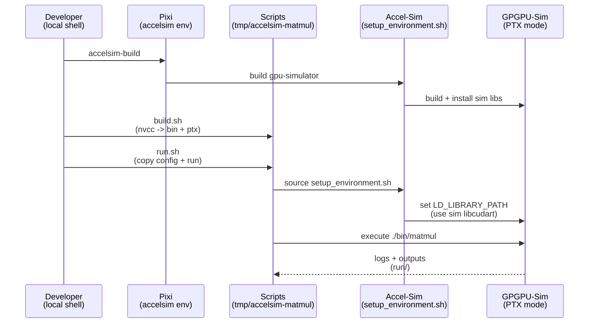

# Plan: Dummy CUDA (.cu) PTX simulation with Accel-Sim

## HEADER
- **Purpose**: Create a minimal CUDA kernel (e.g., matrix multiplication), compile it with system `nvcc`, and run it in Accel-Sim PTX mode as a sanity-check workflow.
- **Status**: Draft (ready for implementation)
- **Date**: 2026-01-29
- **Dependencies**:
  - `pyproject.toml` (Pixi env `accelsim` for building the simulator)
  - `scripts/accelsim/build.sh` (builds Accel-Sim/GPGPU-Sim)
  - `extern/tracked/accel-sim-framework/gpu-simulator/gpgpu-sim/README.md` (PTX-mode run instructions)
  - `extern/tracked/accel-sim-framework/gpu-simulator/gpgpu-sim/configs/tested-cfgs/SM7_QV100/gpgpusim.config` (Volta/SM70 PTX config)
- **Target**: Developers (including future maintainers) and AI assistants

---

## 0. User Stories (what this plan must enable)

These are the user-facing slices of value that this plan targets (mirrors `specs/003-accelsim-dummy-ptx-sim/spec.md`):

1. **P1**: Run a minimal CUDA program under Accel-Sim PTX simulation end-to-end, producing a self-contained run artifact directory.
2. **P2**: Preserve and inspect the exact PTX used by the simulator for the run.
3. **P3**: Validate numerical correctness at small sizes with a deterministic pass/fail signal.
4. **P4**: Switch between supported simulator configurations and record which config was used for each run.
5. **P5**: Fail fast with actionable errors when prerequisites are missing (compiler, simulator build, configs).

## 1. Purpose and Outcome

Success looks like:
- We can build Accel-Sim in this repo (already supported by Pixi `accelsim`).
- We have a self-contained “experiment” folder under `tmp/<subdir>/` containing:
  - A small `.cu` program (naive GEMM/matmul) with a host launcher.
  - Scripts to compile to PTX + executable using system `nvcc`.
  - A run script that executes the binary under GPGPU-Sim/Accel-Sim PTX mode and captures logs.
- The simulation run produces recognizable simulator output (Accel-Sim/GPGPU-Sim banner + stats) and the program completes.

Key outputs/artifacts (kept under `tmp/<subdir>/`):
- `bin/` (compiled executable)
- `ptx/` (generated `.ptx` for inspection)
- `run/` (simulation working dir: `gpgpusim.config`, logs, generated artifacts like extracted PTX/cuobjdump output)

## 2. Implementation Approach

### 2.1 High-level flow

1. Build the simulator once via Pixi: `pixi run -e accelsim accelsim-build`.
2. Create `tmp/accelsim-matmul/` with `src/matmul.cu`, compile/run scripts, and output folders.
3. Compile the `.cu` using an available CUDA compiler:
   - preferred: `pixi run -e cuda13 nvcc ...` (reproducible toolchain in repo)
   - fallback: system `nvcc`
   The build must embed PTX for SM70 (`-gencode arch=compute_70,code=compute_70`) and also emit a standalone `matmul.ptx` for debugging.
4. Run the resulting executable under simulation by sourcing Accel-Sim’s environment (`extern/tracked/accel-sim-framework/gpu-simulator/setup_environment.sh`) and running the binary from a working directory containing `gpgpusim.config` (copied from `SM7_QV100`).
5. Validate the run by checking the logs for the simulator banner and completion, and optionally validate the numeric result (small matrix sizes).

### 2.2 Sequence diagram (steady-state usage)

## 3. Files to Modify or Add

- **context/plans/plan-accelsim-dummy-cu-ptx-simulation.md** add implementation plan (this file)
- **tmp/accelsim-matmul/src/matmul.cu** minimal CUDA matmul (small sizes; prints checksum)
- **tmp/accelsim-matmul/build.sh** compile `matmul.cu` to `bin/matmul` and `ptx/matmul.ptx` with system `nvcc`
- **tmp/accelsim-matmul/run.sh** run `bin/matmul` under PTX-mode simulation, writing logs to `tmp/accelsim-matmul/run/`
- **tmp/accelsim-matmul/run/gpgpusim.config** copied from `extern/tracked/accel-sim-framework/gpu-simulator/gpgpu-sim/configs/tested-cfgs/SM7_QV100/gpgpusim.config`
- **context/summaries/accel-sim-kb/qa-accel-sim-kb.md** (optional) add a follow-up Q&A with exact commands once verified

## 4. TODOs (Implementation Steps)

- [ ] **Pick subdir name** use `tmp/accelsim-matmul/` (or another short, stable name) and create `src/`, `bin/`, `ptx/`, `run/`.
- [ ] **Write dummy kernel** implement naive matmul with small dimensions (e.g., 16–64) and a deterministic output check (checksum or max error vs CPU reference).
- [ ] **Write compile script** `build.sh` should:
  - [ ] Validate a CUDA compiler is available (prefer `pixi run -e cuda13 nvcc`, fallback to `command -v nvcc`)
  - [ ] Emit PTX: `nvcc ... -ptx src/matmul.cu -o ptx/matmul.ptx`
  - [ ] Build executable with embedded PTX: `nvcc ... -gencode arch=compute_70,code=compute_70 ... -o bin/matmul`
  - [ ] Confirm dynamic cudart link: `ldd bin/matmul | rg libcudart`
- [ ] **Prepare sim config** `run.sh` should copy `gpgpusim.config` from `SM7_QV100` into `tmp/accelsim-matmul/run/`.
- [ ] **Run under simulation** `run.sh` should:
  - [ ] `cd extern/tracked/accel-sim-framework && source gpu-simulator/setup_environment.sh`
  - [ ] `cd tmp/accelsim-matmul/run && ../bin/matmul > matmul.sim.log 2>&1`
  - [ ] Grep for banner lines (`Accel-Sim [build`, `GPGPU-Sim Simulator Version`) and exit non-zero if missing.
- [ ] **Capture outputs** keep all logs/artifacts under `tmp/accelsim-matmul/run/` (no outputs outside `tmp/`).
- [ ] **Document the verified recipe** update `context/summaries/accel-sim-kb/qa-accel-sim-kb.md` with the exact compile+run commands used and any gotchas discovered.
