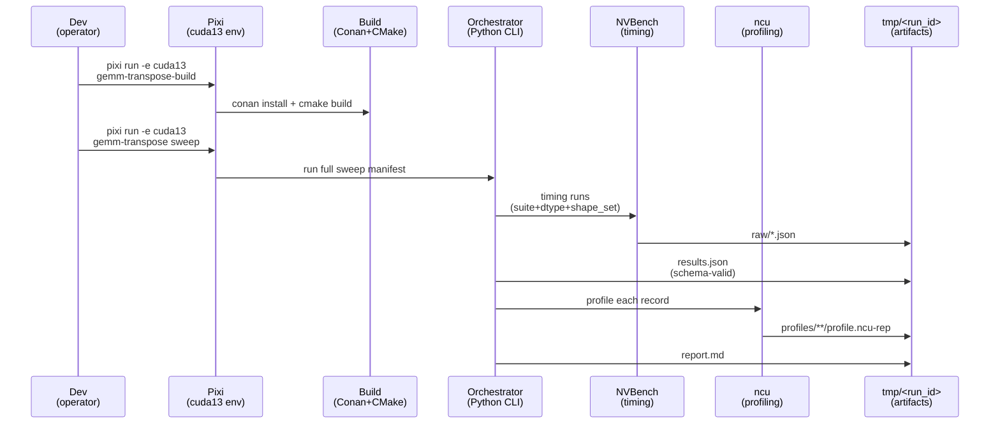

# Plan: GEMM Transpose Full Sweep Testing

## HEADER
- **Purpose**: Define an automated, reproducible way to run *all* shape/dtype sweeps specified in `context/tasks/req-cuda-gemm-test.md`, producing timing + profiling artifacts and a consolidated report.
- **Status**: Draft
- **Date**: 2026-02-02
- **Dependencies**:
  - `context/tasks/req-cuda-gemm-test.md` (sweep requirements)
  - `src/accelsim_test/gemm_transpose_bench/config.py` (shape sets + dtype keys)
  - `src/accelsim_test/gemm_transpose_bench/runner.py` (timing orchestration)
  - `src/accelsim_test/gemm_transpose_bench/profiling.py` (Nsight Compute per-record)
  - `src/accelsim_test/gemm_transpose_bench/export.py` (normalized export + schema validation)
  - `src/accelsim_test/gemm_transpose_bench/report.py` (stakeholder report)
  - `specs/002-gemm-transpose-bench/contracts/results.schema.json` (export contract)
  - `extern/orphan/nvbench/` (benchmarking library source)
  - `pyproject.toml` (Pixi tasks + environments)
- **Target**: Developers and AI assistants running CUDA benchmarking on NVIDIA GPUs.

---

## 1. Purpose and Outcome

Success means we can run a single “full sweep” entry point that:

1) Builds the C++ benchmark in the Pixi `cuda13` environment (`cpp/` as a Conan-managed subproject).
2) Executes NVBench timing for every required (suite, shape, dtype) configuration from `context/tasks/req-cuda-gemm-test.md`.
3) Executes Nsight Compute (`ncu`) profiling for every recorded configuration.
4) Produces a single output directory under `tmp/` containing:
   - raw NVBench JSON outputs,
   - normalized `results.json` (schema-valid),
   - per-record `*.ncu-rep`,
   - a consolidated `report.md` showing **only measured times** (and other metadata like `algo_id_*`).

## 2. Implementation Approach

### 2.1 High-level flow

1. Define a “sweep manifest” that maps requirement sections to concrete `shape_set` + `dtype` combinations.
2. Ensure the implementation can represent all required dtype pairs (including mixed dtype cases called out in the requirement).
3. Add an orchestrated CLI or script that:
   - creates a timestamped `tmp/<run_id>/`,
   - runs timing sweeps in chunks (by suite + dtype + shape_set),
   - merges results deterministically into one `results.json`,
   - runs profiling across all records,
   - generates `report.md`.
4. Add a resumable mechanism so partial runs can be continued (skip already-present records and already-generated `profile.ncu-rep`).

### 2.2 Sweep settings (concrete)

These settings are the single source of truth for “full sweep” behavior (what we run and with which flags).

#### Environment

- Pixi environment: `cuda13`
- Build command: `pixi run -e cuda13 gemm-transpose-build`
- Orchestrator entry point: `pixi run -e cuda13 gemm-transpose ...`
- NVBench source of truth: `extern/orphan/nvbench/` (must remain available on disk for build + metadata capture)

#### Device selection

- Default to a single device for unambiguous exports: NVBench args include `--devices 0` (unless explicitly overridden).

#### Timing run (NVBench, no profiler)

- Default NVBench flags (tunable, but must be recorded into `results.json.run.settings.nvbench`):
  - `--stopping-criterion stdrel`
  - `--min-time 0.5`
  - `--max-noise 0.5`
  - `--min-samples 10`
  - `--devices 0`
- Warmup / timed iterations per single configuration (NVBench “cold” measurement mode):
  - Warmup kernel launches: **1** (not included in reported statistics).
  - Timed kernel launches: **adaptive**, but **at least 10**, and continues until the stopping criterion is satisfied (min total GPU time ≥ `--min-time` and relative noise ≤ `--max-noise`).
  - Reported `timed_ms_*` is the **mean** of the timed samples for that configuration.

#### Profiling run (Nsight Compute per record)

- NVBench flags for profiling mode (minimize iterations; do not use timing as performance under profiler):
  - `--devices 0`
  - `--min-time 0`
  - `--min-samples 1`
  - `--max-noise 999`
  - (optional) `--profile` (NVBench internal; keep if it improves attribution, but `ncu` is authoritative)
- Warmup / timed iterations per single configuration:
  - Warmup kernel launches: **0** (NVBench `--profile` sets “run once” and skips warmup).
  - Timed kernel launches: **1** (single invocation intended for kernel attribution in `ncu`).
- `ncu` flags (baseline; adjust per GPU/driver constraints):
  - `--target-processes all`
  - `--kernel-name-base demangled`
  - `--force-overwrite`
  - Sections/sets to meet minimum requirements (kernel name + launch config + memory + compute signals):
    - `--section LaunchStats`
    - `--section SpeedOfLight`
    - `--section MemoryWorkloadAnalysis`

#### Output directory layout

- Output root: `tmp/gemm_transpose_<YYYYMMDD_HHMMSS>/`
- Expected artifacts:
  - `raw/nvbench_timing_<suite>.json` per timing chunk
  - `results.json` (merged, schema-valid)
  - `profiles/<suite>/<dtype_key>/<MxNxK>/<case>/profile.ncu-rep`
  - `report.md` (measured-time-only tables)

#### Sweep manifest (shapes × dtypes × suites)

This is the explicit list of sweeps required by `context/tasks/req-cuda-gemm-test.md`.

Notes:
- `square` suite records per `(shape,dtype)`: 5 cases (`AB`, `ATB_view`, `ABT_view`, `ATB_copyA`, `ABT_copyB`).
- `nonsquare_atb` suite records per `(shape,dtype)`: 2 cases (`ATB_view`, `ATB_copyA`).
- `nonsquare_abt` suite records per `(shape,dtype)`: 2 cases (`ABT_view`, `ABT_copyB`).

**Dtype keys (currently supported by this repo):**
- `fp16_fp16_fp16`
- `bf16_bf16_bf16`
- `fp32_fp32_fp32`
- `fp32_fp32_fp32_tf32`
- `int8_int8_int32`

**Dtype pairs mentioned in the requirement but not currently implemented (scope decision required):**
- `int8`↔`fp16` mixed (`matmul(int8, fp16)` and `matmul(fp16, int8)`)
- `fp16`↔`fp32` mixed (`matmul(fp16, fp32)` and `matmul(fp32, fp16)`)

**Sweep groups**

1) **Square baseline (“square-ish”)**
   - Suites: `square`
   - Shapes: `512, 1024, 2048, 4096` (`M=N=K`)
   - Dtypes: all supported dtypes above (unless narrowed)

2) **Suggested initial sweep: cache-resident**
   - Suites:
     - `square` (square shapes)
     - `nonsquare_atb` + `nonsquare_abt` (aspect-ratio shapes)
   - Shapes:
     - fp16/bf16 square: `1024, 1536, 2048` (`M=N=K`)
     - fp32 square: `768, 1024, 1280, 1536` (`M=N=K`)
     - fp16/bf16 aspect ratio probes (non-square):
       - `(4096, 1024, 1024)`
       - `(1024, 4096, 1024)`
       - `(1024, 1024, 4096)`
   - Dtypes:
     - fp16/bf16 shapes: `fp16_fp16_fp16`, `bf16_bf16_bf16`
     - fp32 shapes: `fp32_fp32_fp32`, `fp32_fp32_fp32_tf32`

3) **Suggested initial sweep: cache-spill**
   - Suites:
     - `square` (square shapes)
     - `nonsquare_atb` + `nonsquare_abt` (stress shapes)
   - Shapes:
     - fp16/bf16 square boundary: `(2304, 2304, 2304)`
     - fp16/bf16 non-square:
       - copy-A stress: `(3072, 2048, 2048)` (run in `nonsquare_atb`)
       - copy-B stress: `(2048, 3072, 2048)` (run in `nonsquare_abt`)
       - definitely spill: `(8192, 1024, 1024)` (run in both nonsquare suites)
     - fp32 square boundary: `(1664, 1664, 1664)`
     - fp32 non-square:
       - copy-A stress: `(2304, 1536, 1536)` (run in `nonsquare_atb`)
       - copy-B stress: `(1536, 2304, 1536)` (run in `nonsquare_abt`)
   - Dtypes:
     - fp16/bf16 shapes: `fp16_fp16_fp16`, `bf16_bf16_bf16`
     - fp32 shapes: `fp32_fp32_fp32`, `fp32_fp32_fp32_tf32`

4) **Safety control set (dims <= 1000)**
   - Suites: `square`, `nonsquare_atb`, `nonsquare_abt`
   - Shapes:
     - square: `512, 768, 896, 960, 992, 1000` (`M=N=K`)
     - non-square:
       - `(992, 256, 256)`
       - `(256, 992, 256)`
       - `(256, 256, 992)`
       - `(960, 320, 640)`
   - Dtypes: at least `fp16_fp16_fp16`, `bf16_bf16_bf16`, `fp32_fp32_fp32` (and optionally `fp32_fp32_fp32_tf32`, `int8_int8_int32` if supported/desired)

### 2.3 Sequence diagram (steady-state usage)

## 3. Files to Modify or Add

- **`src/accelsim_test/gemm_transpose_bench/config.py`** Add/adjust dtype keys and shape sets to match *all* requirement sweeps (including mixed dtype cases if in-scope).
- **`src/accelsim_test/gemm_transpose_bench/__main__.py`** Add a `sweep` subcommand (or extend existing commands) to run the manifest end-to-end.
- **`src/accelsim_test/gemm_transpose_bench/runner.py`** Add a “run many sweeps” wrapper that groups runs and merges outputs deterministically; add resumability hooks.
- **`src/accelsim_test/gemm_transpose_bench/profiling.py`** Add “skip if rep exists” behavior and ensure profiling covers exactly the records in `results.json`.
- **`src/accelsim_test/gemm_transpose_bench/report.py`** Ensure report formatting remains “measured-time only”, and optionally add a sweep summary section (what ran / what was skipped).
- **`src/accelsim_test/gemm_transpose_bench/export.py`** Optionally record sweep metadata (which manifest group produced each record) to help traceability.
- **`scripts/`** Add a helper script (optional) to run the full sweep with consistent flags, and to print the output directory location.
- **`context/tasks/req-cuda-gemm-test.md`** Keep the requirement doc aligned with what is actually supported (especially dtype-pair coverage).
- **`tests/`** Add unit tests for the sweep manifest expansion (expected number of configurations; correct grouping; determinism).

## 4. TODOs (Implementation Steps)

- [ ] **Extract sweep matrix** Enumerate all shapes and dtypes explicitly required by `context/tasks/req-cuda-gemm-test.md` (square-ish, cache-resident, cache-spill, safety; fp16/bf16/fp32/tf32/int8 and any mixed dtype pairs).
- [ ] **Gap analysis vs current implementation** Compare the required dtype pairs to what `config.py` + C++ currently supports; write down supported vs missing.
- [ ] **Decide mixed-dtype scope** Either implement the missing mixed dtype pairs (int8↔fp16, fp16↔fp32, etc.) or explicitly narrow the requirement (and update the doc) before running “full sweep”.
- [ ] **Define sweep manifest** Create a single source of truth mapping `{sweep_name -> (suite, shape_set, dtype list)}` and ensure it’s stable and testable.
- [ ] **Add `sweep` CLI** Implement `python -m accelsim_test.gemm_transpose_bench sweep --out-dir tmp/<run_id>` that runs timing + profiling + report in one go.
- [ ] **Add resumability** Skip timing runs if the corresponding raw JSON exists and passes schema validation; skip profiling if `profile.ncu-rep` exists.
- [ ] **Make timing flags explicit** Choose and document NVBench args for “full sweep” (e.g., `--min-time`, `--max-noise`, `--devices 0`) and keep them in `results.json.run.settings`.
- [ ] **Validate completeness** Add a post-run check: verify every manifest configuration exists in `results.json` (fail fast if missing).
- [ ] **Add tests** Unit test manifest expansion and completeness checks; integration smoke can continue to gate on `cuda13` + GPU presence.
- [ ] **Document runbook** Add a short “How to run full sweep” section (expected runtime; output tree; how to resume).
