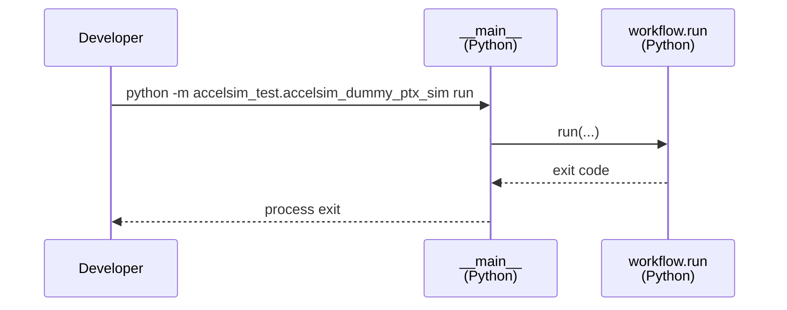
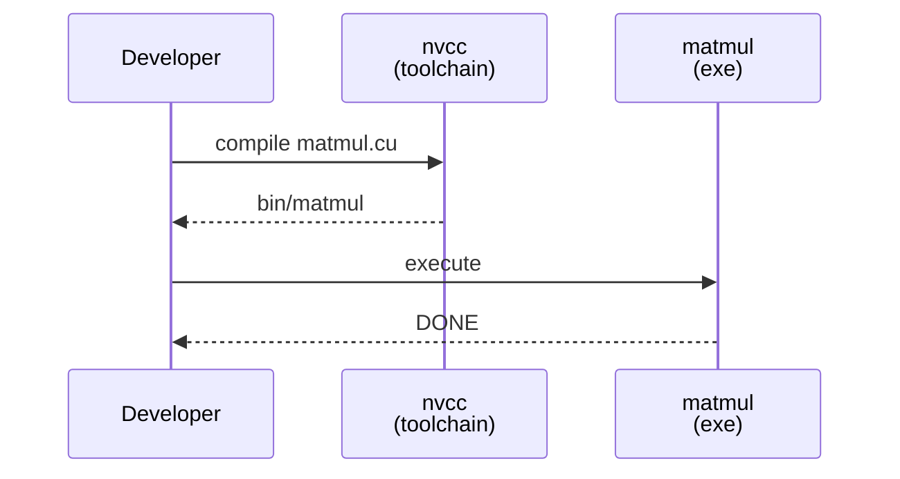
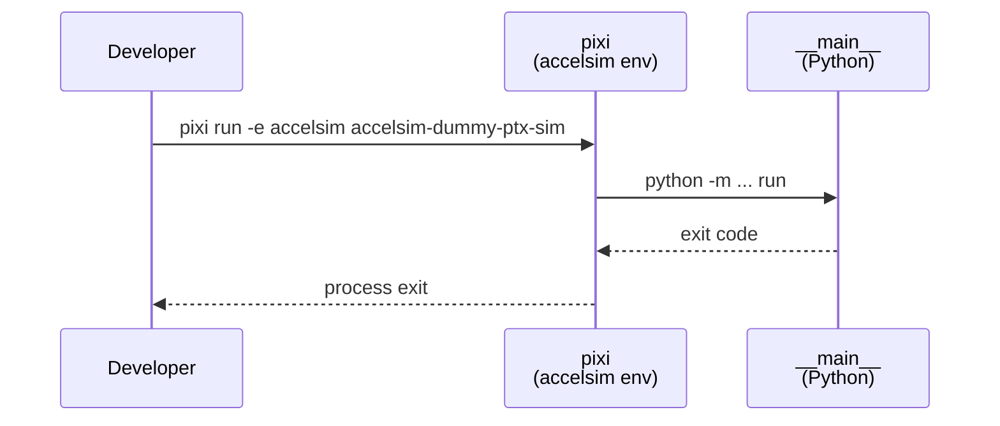

# Implementation Guide: Setup (Shared Infrastructure)

**Phase**: 1 | **Feature**: Accel-Sim Dummy CUDA PTX Simulation | **Tasks**: T001–T003

## Goal

Create the feature’s scaffolding (Python package + CUDA source stub + Pixi task entrypoint) so later phases can implement compile/simulate logic without moving files.

## Public APIs

### T001: Python package skeleton

Deliver a new module `accelsim_test.accelsim_dummy_ptx_sim` under `src/accelsim_test/accelsim_dummy_ptx_sim/` with a module CLI entrypoint (`python -m ...`).

```python
# src/accelsim_test/accelsim_dummy_ptx_sim/__main__.py

from __future__ import annotations

import argparse


def build_parser() -> argparse.ArgumentParser:
    """Build CLI parser for the dummy PTX simulation workflow."""
    raise NotImplementedError


def main(argv: list[str] | None = None) -> int:
    """CLI entrypoint. Returns process exit code."""
    raise NotImplementedError
```

**Usage Flow**:



**Pseudocode**:

```python
def main(argv=None) -> int:
    parser = build_parser()
    ns = parser.parse_args(argv)
    return workflow.run(run_id=ns.run_id, compiler=ns.compiler, config_preset=ns.config_preset)
```

---

### T002: Minimal CUDA source stub

Create `cpp/accelsim_dummy_ptx_sim/matmul.cu` as the permanent CUDA program source for this feature.

```cpp
// cpp/accelsim_dummy_ptx_sim/matmul.cu

#include <cstdio>

int main() {
    // Placeholder: later phases add CUDA kernel + correctness check.
    std::puts("DONE");
    return 0;
}
```

**Usage Flow**:



**Pseudocode**:

```text
nvcc cpp/accelsim_dummy_ptx_sim/matmul.cu -o tmp/.../bin/matmul
```

---

### T003: Pixi task wrapper

Add a Pixi task (wrapper) that runs the Python CLI module from the `accelsim` Pixi environment.

```toml
# pyproject.toml
[tool.pixi.tasks]
accelsim-dummy-ptx-sim = "python -m accelsim_test.accelsim_dummy_ptx_sim run"
```

**Usage Flow**:



**Pseudocode**:

```text
pixi run -e accelsim accelsim-dummy-ptx-sim -- --run-id <id>
```

---

## Phase Integration


## Testing

### Test Input

- None (this phase is scaffolding-only).

### Test Procedure

```bash
# Verify the module can be imported (once created).
pixi run -e accelsim python -c "import accelsim_test.accelsim_dummy_ptx_sim"

# Verify the CLI wiring is reachable (once __main__.py exists).
pixi run -e accelsim python -m accelsim_test.accelsim_dummy_ptx_sim --help
```

### Test Output

- Import succeeds (no traceback).
- `--help` prints usage including a `run` subcommand (once Phase 2 implements parser).

## References

- Spec: `specs/003-accelsim-dummy-ptx-sim/spec.md`
- Plan: `specs/003-accelsim-dummy-ptx-sim/plan.md`

## Implementation Summary

TBD after implementation.

