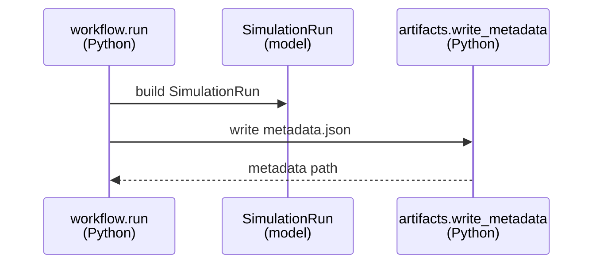
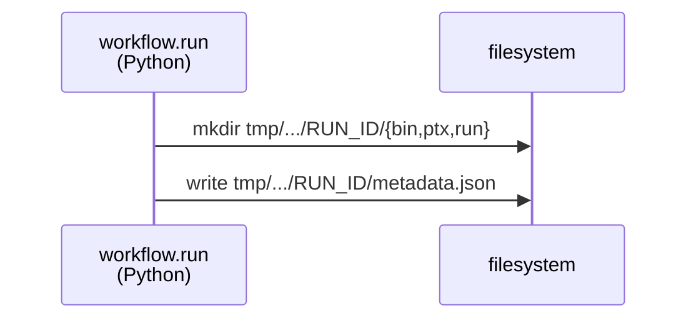
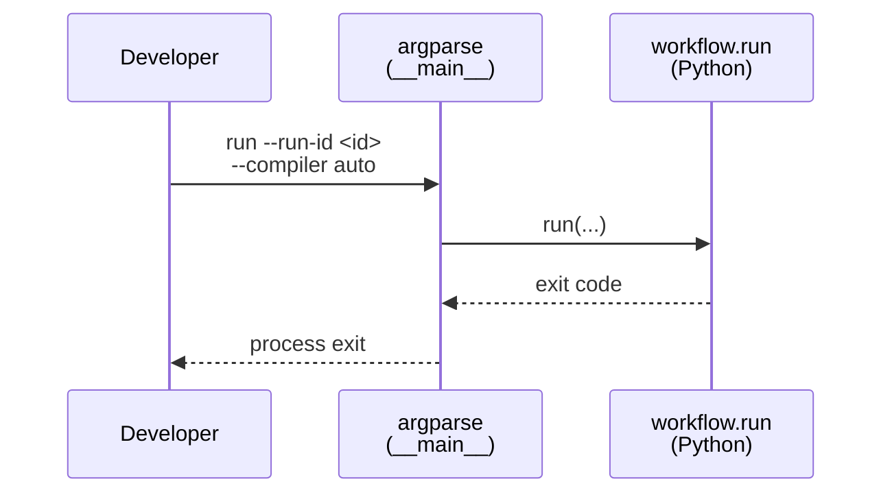
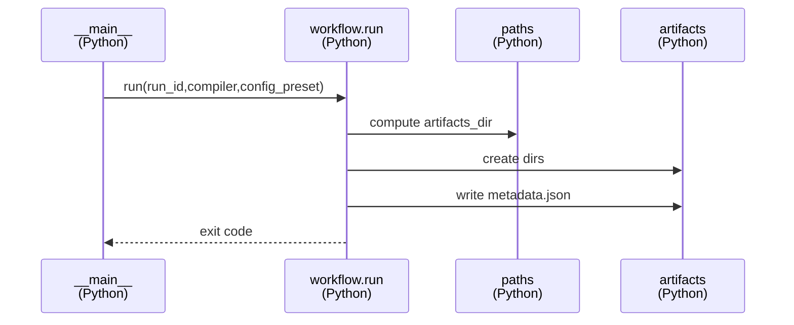
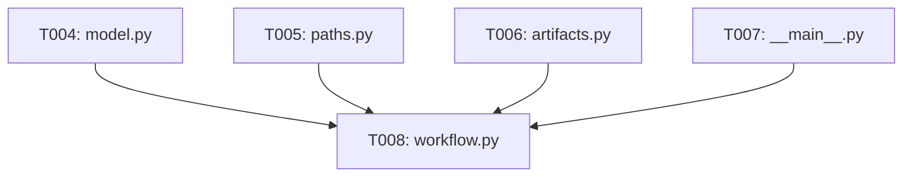

# Implementation Guide: Foundational (Blocking Prerequisites)

**Phase**: 2 | **Feature**: Accel-Sim Dummy CUDA PTX Simulation | **Tasks**: T004–T008

## Goal

Provide the stable Python “orchestration core” for the feature:

- well-typed run metadata models,
- deterministic path/layout rules for artifacts,
- a CLI contract-compliant parser,
- and a single workflow entrypoint that always writes `metadata.json` (even on failure).

## Public APIs

### T004: Core entities (`SimulationRun`, `RunArtifacts`, `PrerequisiteCheck`)

Implement the data model from `specs/003-accelsim-dummy-ptx-sim/data-model.md` and ensure it can be serialized to JSON for `metadata.json`.

```python
# src/accelsim_test/accelsim_dummy_ptx_sim/model.py

from __future__ import annotations

from pathlib import Path
from typing import Any, Literal

import attrs


RunStatus = Literal["pass", "fail"]
CompilerSource = Literal["pixi", "system"]
ConfigPreset = Literal["SM80_A100"]


@attrs.define(frozen=True, slots=True)
class PrerequisiteCheck:
    check_name: str
    status: RunStatus
    details: str | None = None

    def to_dict(self) -> dict[str, Any]:
        return {"check_name": self.check_name, "status": self.status, "details": self.details}


@attrs.define(frozen=True, slots=True)
class RunArtifacts:
    exe_path: Path
    ptx_path: Path
    config_path: Path
    stdout_log_path: Path
    metadata_path: Path

    def to_dict(self) -> dict[str, Any]:
        return {
            "exe_path": str(self.exe_path),
            "ptx_path": str(self.ptx_path),
            "config_path": str(self.config_path),
            "stdout_log_path": str(self.stdout_log_path),
            "metadata_path": str(self.metadata_path),
        }


@attrs.define(frozen=True, slots=True)
class SimulationRun:
    run_id: str
    started_at: str
    finished_at: str | None
    status: RunStatus
    failure_reason: str | None
    mode: Literal["ptx"]
    config_preset: ConfigPreset
    compiler_source: CompilerSource
    artifacts_dir: Path
    git: dict[str, Any]
    commands: dict[str, str]
    prerequisites: list[PrerequisiteCheck] = attrs.field(factory=list)

    def to_dict(self) -> dict[str, Any]:
        return {
            "run_id": self.run_id,
            "started_at": self.started_at,
            "finished_at": self.finished_at,
            "status": self.status,
            "failure_reason": self.failure_reason,
            "mode": self.mode,
            "config_preset": self.config_preset,
            "compiler_source": self.compiler_source,
            "artifacts_dir": str(self.artifacts_dir),
            "git": self.git,
            "commands": self.commands,
            "prerequisites": [c.to_dict() for c in self.prerequisites],
        }
```

**Usage Flow**:



---

### T005: Repo root + path builders

Centralize all filesystem layout decisions so every phase computes paths consistently.

```python
# src/accelsim_test/accelsim_dummy_ptx_sim/paths.py

from __future__ import annotations

import re
from pathlib import Path


def find_repo_root() -> Path:
    """Return the repository root directory."""
    return Path(__file__).resolve().parents[3]


def sanitize_run_id(run_id: str) -> str:
    """Make run_id filesystem-safe and non-empty."""
    s = run_id.strip()
    if not s:
        raise ValueError("run_id must be non-empty")
    return re.sub(r\"[^A-Za-z0-9_.-]+\", \"-\", s)


def run_artifacts_dir(*, repo_root: Path, run_id: str) -> Path:
    return (repo_root / \"tmp\" / \"accelsim_dummy_ptx_sim\" / sanitize_run_id(run_id)).resolve()


def sm80_a100_config_source(*, repo_root: Path) -> Path:
    \"\"\"Source config path from research.md Decision 2.\"\"\"
    return (
        repo_root
        / \"extern\"
        / \"tracked\"
        / \"accel-sim-framework\"
        / \"gpu-simulator\"
        / \"gpgpu-sim\"
        / \"configs\"
        / \"tested-cfgs\"
        / \"SM80_A100\"
        / \"gpgpusim.config\"
    )
```

---

### T006: Artifact layout + metadata writer

Make the on-disk artifact layout deterministic and keep all writes under `tmp/accelsim_dummy_ptx_sim/<run_id>/`.

```python
# src/accelsim_test/accelsim_dummy_ptx_sim/artifacts.py

from __future__ import annotations

import json
from pathlib import Path
from typing import Any


def ensure_empty_run_dir(artifacts_dir: Path) -> None:
    """Fail if the run directory already exists (prevents overwrite)."""
    raise NotImplementedError


def create_artifact_dirs(artifacts_dir: Path) -> dict[str, Path]:
    """Create bin/ ptx/ run/ directories and return their paths."""
    raise NotImplementedError


def write_metadata(metadata_path: Path, payload: dict[str, Any]) -> None:
    metadata_path.write_text(json.dumps(payload, indent=2, sort_keys=True) + \"\\n\")
```

**Usage Flow**:



---

### T007: CLI parsing for `run`

Implement the CLI contract from `specs/003-accelsim-dummy-ptx-sim/contracts/cli.md`.

```python
# src/accelsim_test/accelsim_dummy_ptx_sim/__main__.py

from __future__ import annotations

import argparse


def build_parser() -> argparse.ArgumentParser:
    parser = argparse.ArgumentParser(
        prog=\"accelsim_test.accelsim_dummy_ptx_sim\",
        description=\"Compile and run a dummy CUDA program under Accel-Sim (PTX mode).\",\n    )
    sub = parser.add_subparsers(dest=\"cmd\", required=True)

    run = sub.add_parser(\"run\", help=\"Run compile + simulate workflow.\")
    run.add_argument(\"--run-id\", default=None, help=\"Filesystem-safe run id (default: timestamp).\")\n    run.add_argument(\"--compiler\", default=\"auto\", choices=[\"auto\", \"pixi\", \"system\"])\n    run.add_argument(\"--config-preset\", default=\"sm80_a100\", choices=[\"sm80_a100\"])\n
    return parser
```

**Usage Flow**:



---

### T008: Typed workflow API + CLI wiring

Expose a single, typed entrypoint that does all orchestration and returns a process exit code (0 only on `PASS`).

```python
# src/accelsim_test/accelsim_dummy_ptx_sim/workflow.py

from __future__ import annotations

from pathlib import Path

from .model import SimulationRun


def run(*, run_id: str | None, compiler: str, config_preset: str, repo_root: Path | None = None) -> int:
    \"\"\"Run the workflow and write run artifacts under tmp/.

    Returns:
        0 on success (PASS), non-zero otherwise.
    \"\"\"
    raise NotImplementedError


def build_run_metadata(...) -> SimulationRun:
    \"\"\"Construct SimulationRun (including git info, commands, prerequisites).\"\"\"
    raise NotImplementedError
```

**Usage Flow**:



**Pseudocode**:

```python
def run(...):
    repo = repo_root or paths.find_repo_root()
    run_id = run_id or now_as_run_id()
    artifacts_dir = paths.run_artifacts_dir(repo_root=repo, run_id=run_id)
    artifacts.ensure_empty_run_dir(artifacts_dir)
    layout = artifacts.create_artifact_dirs(artifacts_dir)

    # Later phases populate this with compile/run outcome.
    sim_run = build_run_metadata(...)
    artifacts.write_metadata(layout["metadata_path"], {"run": sim_run.to_dict(), "artifacts": ...})
    return 1
```

---

## Phase Integration



## Testing

### Test Input

- None (unit tests in later phases will exercise these modules without requiring the simulator).

### Test Procedure

```bash
# Run unit tests (once tests are added in later phases).
pixi run pytest -q tests/unit/test_accelsim_dummy_ptx_sim_*.py
```

### Test Output

- `N passed` for unit tests that validate run-id sanitization and artifact layout.

## References

- Spec: `specs/003-accelsim-dummy-ptx-sim/spec.md`
- Data model: `specs/003-accelsim-dummy-ptx-sim/data-model.md`
- Contracts: `specs/003-accelsim-dummy-ptx-sim/contracts/cli.md`

## Implementation Summary

TBD after implementation.
