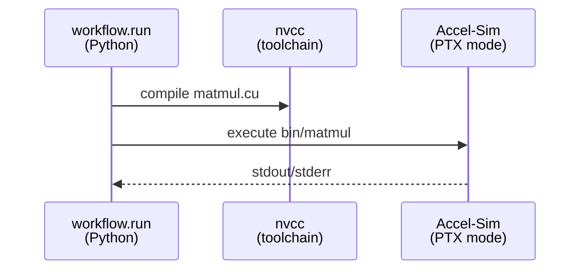
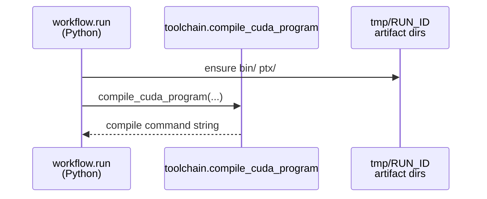
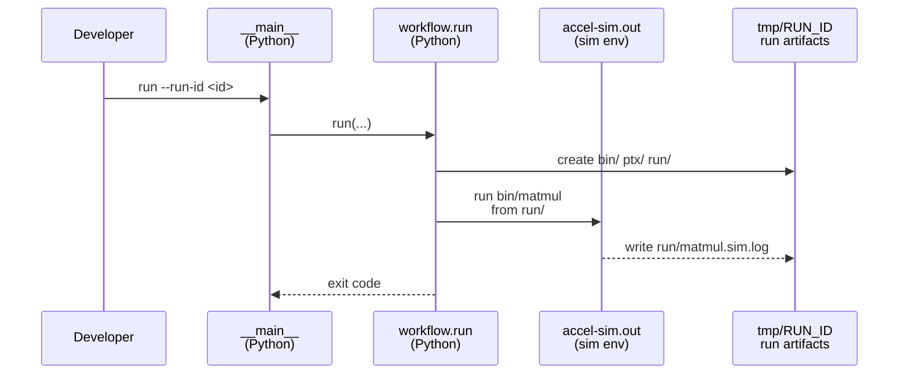
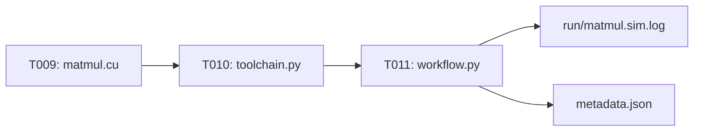

# Implementation Guide: US1 End-to-End PTX Simulation (MVP)

**Phase**: 3 | **Feature**: Accel-Sim Dummy CUDA PTX Simulation | **Tasks**: T009–T013

## Goal

Deliver a minimal, end-to-end “compile → PTX-mode simulate → capture artifacts” workflow that produces a per-run directory under `tmp/accelsim_dummy_ptx_sim/<run_id>/` containing:

- `bin/matmul` (executable),
- `ptx/matmul.ptx` (standalone PTX),
- `run/gpgpusim.config` (copied preset),
- `run/matmul.sim.log` (captured stdout/stderr),
- `metadata.json` (machine-readable run metadata).

## Public APIs

### T009: Minimal CUDA program (fast, prints completion)

Implement a tiny CUDA program that can run under GPGPU-Sim PTX mode and prints a clear completion line (initially `DONE`).

```cpp
// cpp/accelsim_dummy_ptx_sim/matmul.cu

#include <cstdio>

__global__ void matmul_naive(const float* A, const float* B, float* C, int n) {
    int row = (int)blockIdx.y * blockDim.y + threadIdx.y;
    int col = (int)blockIdx.x * blockDim.x + threadIdx.x;
    if (row >= n || col >= n) return;
    float sum = 0.0f;
    for (int k = 0; k < n; ++k) sum += A[row * n + k] * B[k * n + col];
    C[row * n + col] = sum;
}

int main() {
    // Later phases add deterministic inputs + CPU reference.
    std::puts("DONE");
    return 0;
}
```

**Usage Flow**:



---

### T010: `nvcc` selection + compile command builder

Implement `--compiler auto|pixi|system` selection and compile into the run’s `bin/` and `ptx/` directories. Target `compute_80` per `research.md` Decision 3.

```python
# src/accelsim_test/accelsim_dummy_ptx_sim/toolchain.py

from __future__ import annotations

import shlex
import subprocess
from pathlib import Path
from typing import Literal


CompilerMode = Literal["auto", "pixi", "system"]


def build_nvcc_compile_argv(*, nvcc: str, src: Path, exe_out: Path, ptx_out: Path) -> list[str]:
    \"\"\"Return argv for building embedded PTX + standalone PTX (compute_80).\"\"\"
    return [
        nvcc,
        str(src),
        \"-O2\",
        \"-std=c++17\",
        \"-lineinfo\",
        \"-gencode\",
        \"arch=compute_80,code=compute_80\",
        \"-o\",
        str(exe_out),
        \"--ptx\",
        \"-o\",
        str(ptx_out),
    ]


def resolve_nvcc(mode: CompilerMode) -> tuple[str, str]:
    \"\"\"Return (compiler_source, nvcc_command).

    compiler_source is recorded in metadata: \"pixi\" or \"system\".
    \"\"\"
    raise NotImplementedError


def compile_cuda_program(*, mode: CompilerMode, src: Path, exe_out: Path, ptx_out: Path) -> str:
    \"\"\"Compile and return the rendered compile command string for metadata.\"\"\"
    source, nvcc = resolve_nvcc(mode)
    argv = build_nvcc_compile_argv(nvcc=nvcc, src=src, exe_out=exe_out, ptx_out=ptx_out)
    subprocess.check_call(argv)
    return shlex.join(argv)
```

**Usage Flow**:



---

### T011: End-to-end workflow (compile + simulate + capture log)

Run by sourcing Accel-Sim’s `setup_environment.sh` and executing `bin/matmul` from the run working directory that contains `run/gpgpusim.config`.

```python
# src/accelsim_test/accelsim_dummy_ptx_sim/workflow.py

from __future__ import annotations

import subprocess
from pathlib import Path


def run_simulation(*, repo_root: Path, run_dir: Path, exe_path: Path, log_path: Path) -> str:
    \"\"\"Execute the program under the simulator environment and return the rendered command string.\"\"\"
    env_script = repo_root / \"extern\" / \"tracked\" / \"accel-sim-framework\" / \"gpu-simulator\" / \"setup_environment.sh\"
    cmd = [
        \"bash\",
        \"-lc\",
        \" \".join(
            [
                \"export GPGPUSIM_SETUP_ENVIRONMENT_WAS_RUN=\",\n                f\"source {env_script}\",\n                f\"cd {run_dir}\",\n                f\"{exe_path}\",\n            ]
        ),
    ]
    with log_path.open(\"wb\") as f:
        subprocess.check_call(cmd, cwd=repo_root, stdout=f, stderr=subprocess.STDOUT)
    return \"bash -lc <run simulation>\"  # for metadata: render real string in implementation
```

**Usage Flow**:



**Pseudocode**:

```python
def run(...):
    # 1) Create run dirs + metadata skeleton
    # 2) Compile matmul.cu into bin/ and ptx/
    # 3) Copy preset gpgpusim.config into run/
    # 4) Execute under simulator env, capture log
    # 5) Write metadata.json
```

---

### T012: Quickstart validation

Update `specs/003-accelsim-dummy-ptx-sim/quickstart.md` to match:

- the implemented CLI flags and defaults,
- artifact directory layout,
- and the expected “banner + DONE/PASS” log markers.

---

### T013: Unit tests for run-id sanitization + artifact layout

Add tests that validate the deterministic path/layout rules without invoking the simulator.

```python
# tests/unit/test_accelsim_dummy_ptx_sim_paths.py

from __future__ import annotations

from pathlib import Path

from accelsim_test.accelsim_dummy_ptx_sim import paths


def test_sanitize_run_id_filesystem_safe() -> None:
    assert paths.sanitize_run_id(\"hello world\") == \"hello-world\"


def test_run_artifacts_dir_under_tmp() -> None:
    repo = Path(\"/tmp/fake-repo\")
    p = paths.run_artifacts_dir(repo_root=repo, run_id=\"r1\")
    assert str(p).endswith(\"/tmp/fake-repo/tmp/accelsim_dummy_ptx_sim/r1\")
```

---

## Phase Integration



## Testing

### Test Input

- Submodules initialized (required for simulator env):
  - `<workspace>/extern/tracked/accel-sim-framework/`
- Accel-Sim built once (quickstart prerequisite):
  - `<workspace>/extern/tracked/accel-sim-framework/gpu-simulator/bin/release/accel-sim.out`
- A run id to keep outputs isolated:
  - Example: `2026-02-03T00-00-00Z`

### Test Procedure

```bash
cd <workspace>
pixi install -e accelsim
pixi run -e accelsim accelsim-build
pixi run -e accelsim accelsim-smoke

# MVP run:
pixi run -e accelsim python -m accelsim_test.accelsim_dummy_ptx_sim run --run-id 2026-02-03T00-00-00Z
```

### Test Output

- Artifact directory exists: `<workspace>/tmp/accelsim_dummy_ptx_sim/2026-02-03T00-00-00Z/`
- Files exist:
  - `bin/matmul`
  - `ptx/matmul.ptx`
  - `run/gpgpusim.config`
  - `run/matmul.sim.log`
  - `metadata.json`
- `run/matmul.sim.log` includes an Accel-Sim banner line and `DONE` (or later `PASS`).

## References

- Spec: `specs/003-accelsim-dummy-ptx-sim/spec.md`
- Research: `specs/003-accelsim-dummy-ptx-sim/research.md`
- Quickstart: `specs/003-accelsim-dummy-ptx-sim/quickstart.md`
- Contract: `specs/003-accelsim-dummy-ptx-sim/contracts/cli.md`

## Implementation Summary

TBD after implementation.
