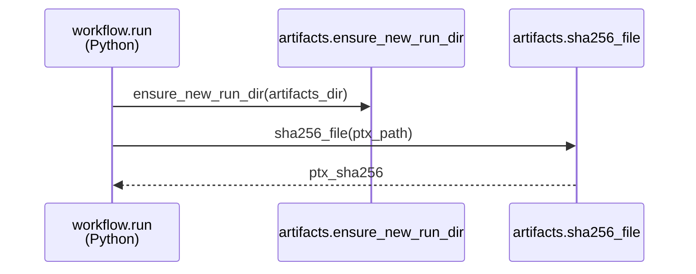
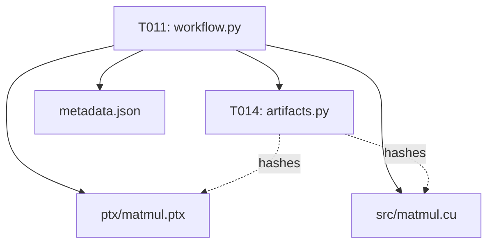

# Implementation Guide: US2 PTX Provenance (No Overwrites)

**Phase**: 4 | **Feature**: Accel-Sim Dummy CUDA PTX Simulation | **Tasks**: T014–T016

## Goal

Make each run’s PTX artifact provable and non-ambiguous by:

- refusing to overwrite an existing run directory,
- recording file hashes in `metadata.json`,
- and copying source into the run directory.

## Public APIs

### T014: Collision prevention + hashing utilities

Extend `artifacts.py` with collision checks and content hashing for the PTX (and later source).

```python
# src/accelsim_test/accelsim_dummy_ptx_sim/artifacts.py

from __future__ import annotations

import hashlib
from pathlib import Path


def sha256_file(path: Path) -> str:
    h = hashlib.sha256()
    with path.open(\"rb\") as f:
        for chunk in iter(lambda: f.read(1 << 20), b\"\"):
            h.update(chunk)
    return h.hexdigest()


def ensure_new_run_dir(artifacts_dir: Path) -> None:
    \"\"\"Raise FileExistsError if artifacts_dir already exists.\"\"\"
    if artifacts_dir.exists():
        raise FileExistsError(f\"Refusing to overwrite existing run dir: {artifacts_dir}\")
```

**Usage Flow**:



---

### T015: Copy CUDA source into run artifacts

Copy `cpp/accelsim_dummy_ptx_sim/matmul.cu` into the run directory (e.g., `src/matmul.cu`) and record its hash and path in metadata.

```python
# src/accelsim_test/accelsim_dummy_ptx_sim/workflow.py

from __future__ import annotations

import shutil
from pathlib import Path

from . import artifacts


def copy_source_into_run(*, src: Path, dst_dir: Path) -> tuple[Path, str]:
    dst = dst_dir / \"src\" / src.name
    dst.parent.mkdir(parents=True, exist_ok=True)
    shutil.copy2(src, dst)
    return dst, artifacts.sha256_file(dst)
```

---

### T016: Unit tests for hashing + collision behavior

Write tests that validate:

- attempting to reuse an existing run directory raises,
- and hashes are stable.

```python
# tests/unit/test_accelsim_dummy_ptx_sim_artifacts.py

from __future__ import annotations

from pathlib import Path

import pytest

from accelsim_test.accelsim_dummy_ptx_sim import artifacts


def test_ensure_new_run_dir_refuses_overwrite(tmp_path: Path) -> None:
    run_dir = tmp_path / \"run1\"
    run_dir.mkdir()
    with pytest.raises(FileExistsError):
        artifacts.ensure_new_run_dir(run_dir)


def test_sha256_file_stable(tmp_path: Path) -> None:
    p = tmp_path / \"x.txt\"
    p.write_text(\"abc\")
    assert artifacts.sha256_file(p) == artifacts.sha256_file(p)
```

---

## Phase Integration



## Testing

### Test Input

- Unit tests only; no simulator needed.

### Test Procedure

```bash
pixi run pytest -q tests/unit/test_accelsim_dummy_ptx_sim_artifacts.py
```

### Test Output

- `N passed`

## References

- Spec: `specs/003-accelsim-dummy-ptx-sim/spec.md`
- Data model: `specs/003-accelsim-dummy-ptx-sim/data-model.md`

## Implementation Summary

TBD after implementation.

