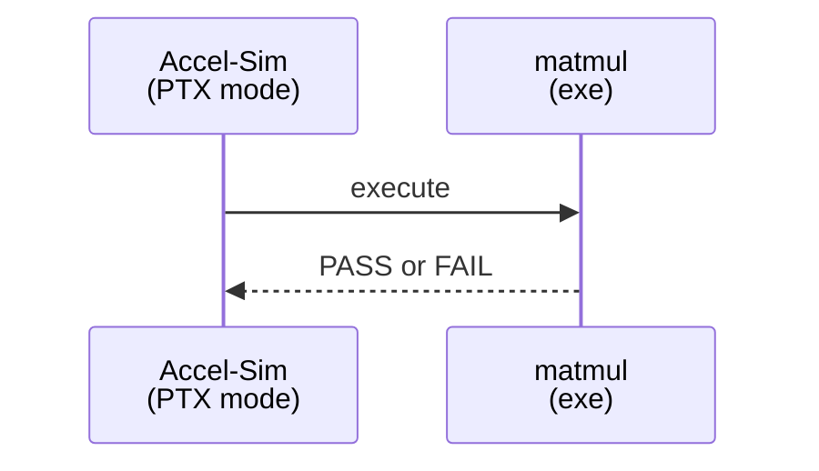
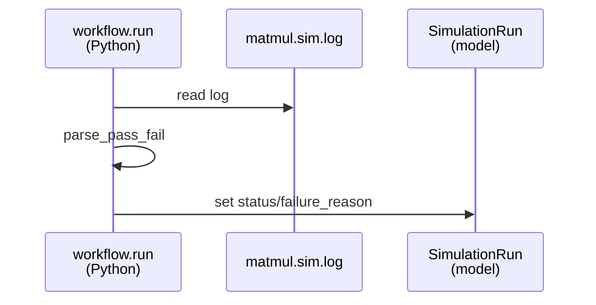

# Implementation Guide: US3 Correctness (PASS/FAIL)

**Phase**: 5 | **Feature**: Accel-Sim Dummy CUDA PTX Simulation | **Tasks**: T017–T019

## Goal

Add a deterministic correctness signal so the workflow is trustworthy:

- CUDA program prints `PASS` or `FAIL`,
- exits non-zero on `FAIL`,
- workflow parses the log and sets `SimulationRun.status`/`failure_reason`,
- CLI exits `0` only on `PASS`.

## Public APIs

### T017: CPU reference + deterministic inputs + PASS/FAIL

Implement a small-size matmul with deterministic initialization and a CPU reference (tolerance-based).

```cpp
// cpp/accelsim_dummy_ptx_sim/matmul.cu

#include <cmath>
#include <cstdio>
#include <vector>

static void cpu_ref(const std::vector<float>& A, const std::vector<float>& B, std::vector<float>& C, int n) {
    for (int i = 0; i < n; ++i) {
        for (int j = 0; j < n; ++j) {
            float sum = 0.0f;
            for (int k = 0; k < n; ++k) sum += A[i * n + k] * B[k * n + j];
            C[i * n + j] = sum;
        }
    }
}

static bool allclose(const std::vector<float>& got, const std::vector<float>& ref, float atol) {
    for (size_t i = 0; i < got.size(); ++i) {
        if (std::fabs(got[i] - ref[i]) > atol) return false;
    }
    return true;
}

int main() {
    // Deterministic small problem size for simulation.
    const int n = 16;
    // Initialize A/B deterministically, run GPU kernel, copy back, compare.
    // Print PASS/FAIL and return 0/1.
    std::puts(\"PASS\");
    return 0;
}
```

**Usage Flow**:



---

### T018: Parse PASS/FAIL and enforce exit codes

Extend the workflow to parse `run/matmul.sim.log` and set run status accordingly.

```python
# src/accelsim_test/accelsim_dummy_ptx_sim/workflow.py

from __future__ import annotations

from pathlib import Path


def parse_pass_fail(log_path: Path) -> tuple[str, str | None]:
    \"\"\"Return (status, failure_reason).

    status is \"pass\" iff log contains a PASS marker and no FAIL marker.
    \"\"\"
    text = log_path.read_text(errors=\"replace\")
    if \"PASS\" in text and \"FAIL\" not in text:
        return \"pass\", None
    if \"FAIL\" in text:
        return \"fail\", \"correctness_mismatch\"
    return \"fail\", \"missing_pass_fail_marker\"
```

**Usage Flow**:



---

### T019: Unit tests for log parsing and status mapping

```python
# tests/unit/test_accelsim_dummy_ptx_sim_status.py

from __future__ import annotations

from pathlib import Path

from accelsim_test.accelsim_dummy_ptx_sim.workflow import parse_pass_fail


def test_parse_pass() -> None:
    p = Path(\"/tmp/accelsim_dummy_ptx_sim_test_pass.log\")
    p.write_text(\"... PASS ...\")
    assert parse_pass_fail(p) == (\"pass\", None)
```

---

## Phase Integration


## Testing

### Test Input

- For unit tests: synthetic log files created under pytest temp dirs.
- For manual validation: a normal run directory under `<workspace>/tmp/accelsim_dummy_ptx_sim/<run_id>/`.

### Test Procedure

```bash
# Unit tests:
pixi run pytest -q tests/unit/test_accelsim_dummy_ptx_sim_status.py

# Manual run (requires simulator prerequisites):
pixi run -e accelsim python -m accelsim_test.accelsim_dummy_ptx_sim run --run-id 2026-02-03T00-00-00Z
```

### Test Output

- Unit tests pass.
- Manual run:
  - `run/matmul.sim.log` contains exactly one `PASS` marker (and no `FAIL`).
  - CLI returns exit code `0`.

## References

- Spec: `specs/003-accelsim-dummy-ptx-sim/spec.md`
- Data model: `specs/003-accelsim-dummy-ptx-sim/data-model.md`

## Implementation Summary

TBD after implementation.

