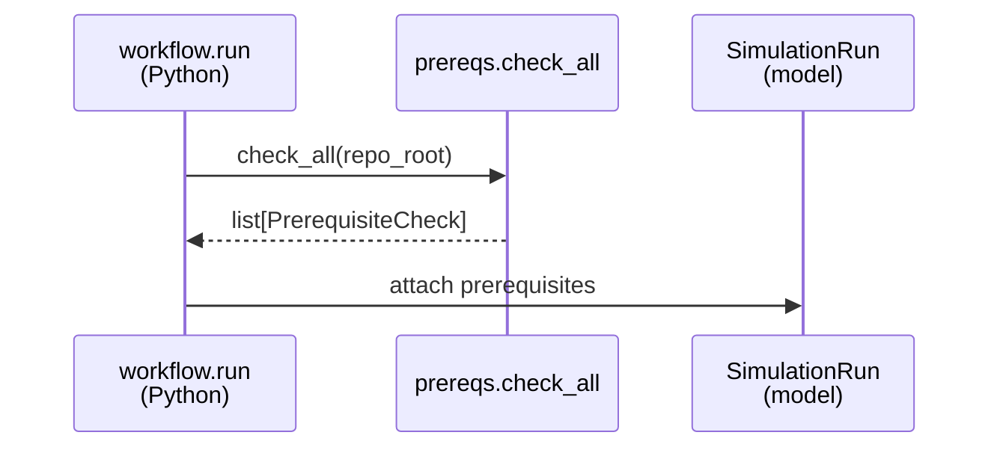
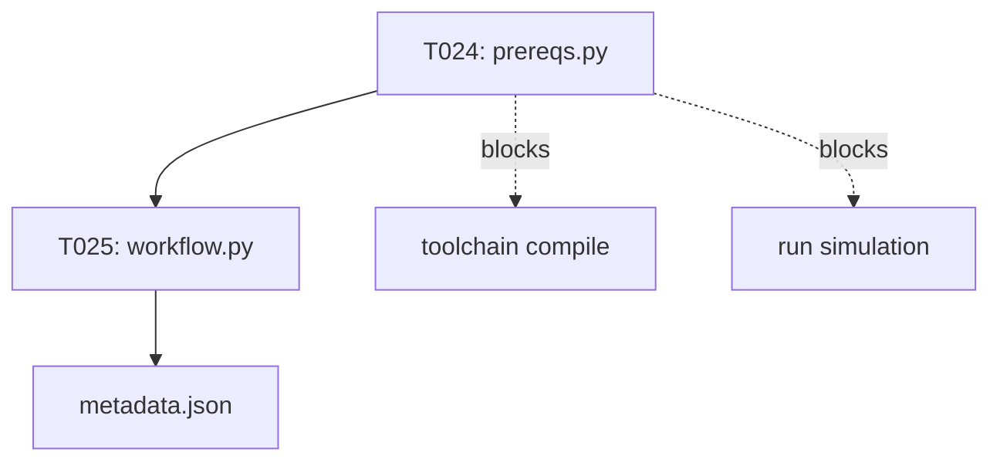

# Implementation Guide: US5 Fail-Fast Prerequisites

**Phase**: 7 | **Feature**: Accel-Sim Dummy CUDA PTX Simulation | **Tasks**: T024–T027

## Goal

Detect missing prerequisites before attempting compile/simulate, and fail with actionable guidance while still producing `metadata.json` with `status=fail`.

## Public APIs

### T024: Prerequisite checks

Implement checks as pure functions returning `PrerequisiteCheck` objects with fix-it hints.

```python
# src/accelsim_test/accelsim_dummy_ptx_sim/prereqs.py

from __future__ import annotations

from pathlib import Path

from .model import PrerequisiteCheck


def check_submodule_initialized(repo_root: Path) -> PrerequisiteCheck:
    p = repo_root / \"extern\" / \"tracked\" / \"accel-sim-framework\" / \".git\"
    if p.exists():
        return PrerequisiteCheck(check_name=\"submodule_initialized\", status=\"pass\")
    return PrerequisiteCheck(
        check_name=\"submodule_initialized\",
        status=\"fail\",
        details=\"Run: git submodule update --init --recursive\",
    )


def check_simulator_built(repo_root: Path) -> PrerequisiteCheck:
    exe = repo_root / \"extern\" / \"tracked\" / \"accel-sim-framework\" / \"gpu-simulator\" / \"bin\" / \"release\" / \"accel-sim.out\"
    if exe.exists():
        return PrerequisiteCheck(check_name=\"simulator_built\", status=\"pass\")
    return PrerequisiteCheck(
        check_name=\"simulator_built\",
        status=\"fail\",
        details=\"Run: pixi run -e accelsim accelsim-build\",
    )


def check_tmp_writable(repo_root: Path) -> PrerequisiteCheck:
    tmp = repo_root / \"tmp\"
    try:
        tmp.mkdir(exist_ok=True)
        test = tmp / \".write_test\"
        test.write_text(\"ok\")
        test.unlink()
        return PrerequisiteCheck(check_name=\"tmp_writable\", status=\"pass\")
    except Exception as e:
        return PrerequisiteCheck(check_name=\"tmp_writable\", status=\"fail\", details=str(e))


def check_all(repo_root: Path) -> list[PrerequisiteCheck]:
    return [
        check_submodule_initialized(repo_root),
        check_simulator_built(repo_root),
        check_tmp_writable(repo_root),
    ]
```

**Usage Flow**:



---

### T025: Workflow integration

Short-circuit on failures before compile/run and print a concise checklist to stderr. Always write metadata.

```python
# src/accelsim_test/accelsim_dummy_ptx_sim/workflow.py

from __future__ import annotations

import sys

from . import prereqs


def format_prereq_failures(checks: list) -> str:
    lines: list[str] = [\"Missing prerequisites:\"]\n    for c in checks:
        if c.status == \"fail\":
            hint = f\" - {c.details}\" if c.details else \"\"\n            lines.append(f\"- {c.check_name}{hint}\")\n    return \"\\n\".join(lines)


def run(...):
    checks = prereqs.check_all(repo_root)\n    if any(c.status == \"fail\" for c in checks):
        print(format_prereq_failures(checks), file=sys.stderr)
        # write metadata.json with status=fail
        return 2
```

---

### T026: Unit tests for prerequisite checks

Test `prereqs` using temporary directories (don’t depend on real submodules in unit tests).

```python
# tests/unit/test_accelsim_dummy_ptx_sim_prereqs.py

from __future__ import annotations

from pathlib import Path

from accelsim_test.accelsim_dummy_ptx_sim import prereqs


def test_check_tmp_writable_passes(tmp_path: Path) -> None:
    c = prereqs.check_tmp_writable(tmp_path)
    assert c.status == \"pass\"
```

---

### T027: Quickstart troubleshooting section

Add a short “Troubleshooting” section to `specs/003-accelsim-dummy-ptx-sim/quickstart.md` covering:

- missing submodule init,
- missing simulator build,
- missing `nvcc`,
- permission issues with `tmp/`,
- hangs/slow runs (suggest smaller sizes / confirm PTX-mode only).

---

## Phase Integration



## Testing

### Test Input

- Unit-test temp dirs.
- For manual negative tests, intentionally break a prerequisite:
  - rename `<workspace>/extern/tracked/accel-sim-framework/` temporarily, or
  - remove `<workspace>/extern/tracked/accel-sim-framework/gpu-simulator/bin/release/accel-sim.out`.

### Test Procedure

```bash
pixi run pytest -q tests/unit/test_accelsim_dummy_ptx_sim_prereqs.py

# Manual: expect fail-fast with actionable output
pixi run -e accelsim python -m accelsim_test.accelsim_dummy_ptx_sim run --run-id prereq-fail-demo
```

### Test Output

- Unit tests pass.
- Manual run fails fast with a checklist of missing prerequisites and still writes:
  - `<workspace>/tmp/accelsim_dummy_ptx_sim/prereq-fail-demo/metadata.json`

## References

- Spec: `specs/003-accelsim-dummy-ptx-sim/spec.md`
- Data model: `specs/003-accelsim-dummy-ptx-sim/data-model.md`
- Quickstart: `specs/003-accelsim-dummy-ptx-sim/quickstart.md`

## Implementation Summary

TBD after implementation.

