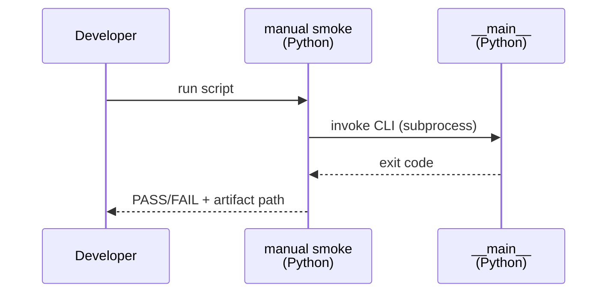
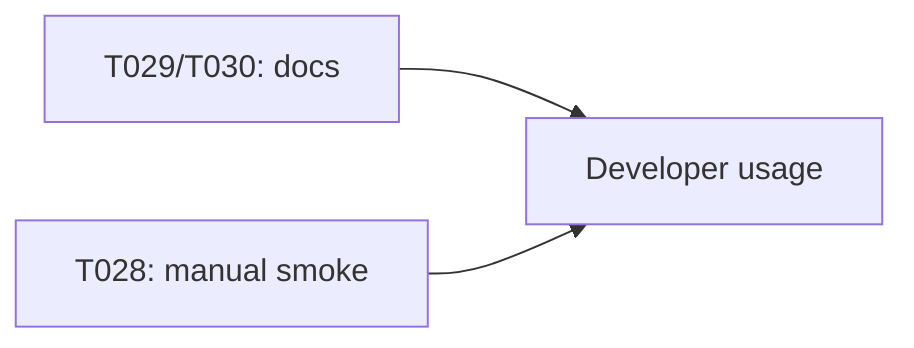

# Implementation Guide: Polish & Cross-Cutting Concerns

**Phase**: 8 | **Feature**: Accel-Sim Dummy CUDA PTX Simulation | **Tasks**: T028–T030

## Goal

Make the feature easier to use and maintain by adding:

- a manual smoke helper script,
- README links for discoverability,
- and a final contract/quickstart validation pass.

## Public APIs

### T028: Manual smoke-run helper

Add a manual script that:

- checks prerequisites (reusing `prereqs.py`),
- runs the CLI if prerequisites pass,
- prints the artifact directory location.

```python
# tests/manual/run_accelsim_dummy_ptx_sim_smoke.py

from __future__ import annotations

import subprocess
from pathlib import Path

from accelsim_test.accelsim_dummy_ptx_sim import paths, prereqs


def main() -> int:
    repo_root = paths.find_repo_root()
    checks = prereqs.check_all(repo_root)
    if any(c.status == \"fail\" for c in checks):
        print(\"Skipping: missing prerequisites\")\n        return 0

    run_id = \"smoke\"\n    cmd = [\n        \"pixi\",\n        \"run\",\n        \"-e\",\n        \"accelsim\",\n        \"python\",\n        \"-m\",\n        \"accelsim_test.accelsim_dummy_ptx_sim\",\n        \"run\",\n        \"--run-id\",\n        run_id,\n    ]
    return subprocess.call(cmd, cwd=repo_root)
```

**Usage Flow**:



---

### T029: README links

Update `README.md` to include a section pointing to:

- `specs/003-accelsim-dummy-ptx-sim/quickstart.md`
- `specs/003-accelsim-dummy-ptx-sim/contracts/cli.md`

---

### T030: Contract + quickstart validation

Reconcile the implemented CLI flags, artifact layout, and exit codes against `contracts/cli.md` and ensure `quickstart.md` is accurate.

---

## Phase Integration



## Testing

### Test Input

- Working simulator prerequisites (for smoke script), otherwise it should skip.

### Test Procedure

```bash
# Manual smoke (skips when prerequisites are missing):
pixi run -e accelsim python tests/manual/run_accelsim_dummy_ptx_sim_smoke.py
```

### Test Output

- If prerequisites present: the script triggers a run and exits 0 only on PASS.
- If prerequisites missing: the script exits 0 after printing a skip reason.

## References

- Quickstart: `specs/003-accelsim-dummy-ptx-sim/quickstart.md`
- Contract: `specs/003-accelsim-dummy-ptx-sim/contracts/cli.md`

## Implementation Summary

TBD after implementation.

