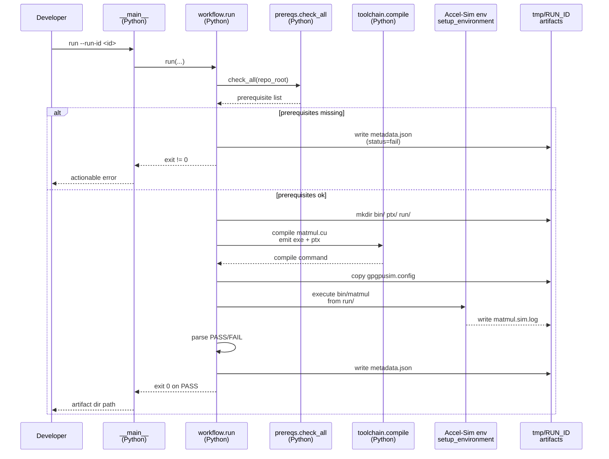
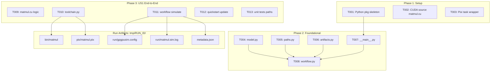
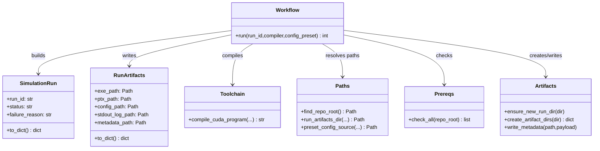
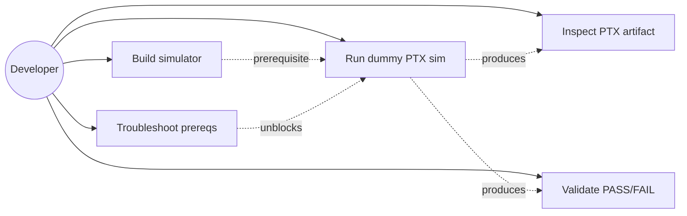
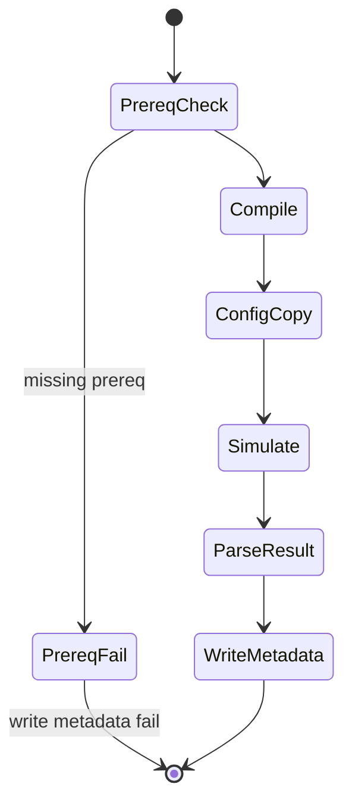

# Phase Integration Guide: Accel-Sim Dummy CUDA PTX Simulation

**Feature**: `003-accelsim-dummy-ptx-sim` | **Phases**: 8

## Overview

This feature is a file-based workflow orchestrated by Python (Pixi) that compiles a minimal CUDA program to embedded PTX and then runs it under Accel-Sim’s PTX-mode simulation. Each run produces a self-contained artifact directory under `tmp/accelsim_dummy_ptx_sim/<run_id>/` that captures the executable, emitted PTX, simulator config copy, simulator output, and a machine-readable `metadata.json`.

Implementation is staged so each phase adds a thin slice: scaffolding → core models/paths → end-to-end run → provenance → correctness gating → preset selection → fail-fast prerequisites → polish/docs.

## Phase Flow

**MUST HAVE: End-to-End Sequence Diagram**



## Artifact Flow Between Phases



## System Architecture



## Use Cases



## Activity Flow



## Inter-Phase Dependencies

### Phase 1 → Phase 2

**Artifacts**:

- No runtime artifacts; this is code scaffolding only.

**Code Dependencies**:

- Phase 2 assumes the module layout created in Phase 1:
  - `src/accelsim_test/accelsim_dummy_ptx_sim/{model,paths,artifacts,workflow,__main__}.py`

### Phase 2 → Phase 3

**Artifacts**:

- The run directory layout (Phase 2) is the contract Phase 3 populates:
  - `<workspace>/tmp/accelsim_dummy_ptx_sim/<run_id>/{bin,ptx,run}/`
  - `<workspace>/tmp/accelsim_dummy_ptx_sim/<run_id>/metadata.json`

**Code Dependencies**:

```python
from accelsim_test.accelsim_dummy_ptx_sim import artifacts, paths, toolchain
from accelsim_test.accelsim_dummy_ptx_sim.model import SimulationRun
```

### Phase 3 → Phase 4/5/6/7

**Artifacts**:

- `ptx/matmul.ptx` becomes hashable/provenanced (Phase 4).
- `run/matmul.sim.log` becomes a correctness signal (Phase 5).
- `run/gpgpusim.config` becomes preset-selected (Phase 6).
- `metadata.json` becomes richer with prerequisite check results (Phase 7).

## Integration Testing

```bash
# Unit-test the orchestration helpers (no simulator):
pixi run pytest -q tests/unit/test_accelsim_dummy_ptx_sim_*.py

# Manual end-to-end run (requires simulator prerequisites):
pixi run -e accelsim python -m accelsim_test.accelsim_dummy_ptx_sim run --run-id 2026-02-03T00-00-00Z
```

## Critical Integration Points

1. **Compute capability alignment**
   - Compile with `compute_80` (Decision 3) and use SM80_A100 preset (Decision 2).
   - Mismatch here is a common “kernel load” failure mode.

2. **Working directory + config placement**
   - The simulator expects `gpgpusim.config` in the working directory where the app is run.
   - Always `cd` into `<run_dir>/run/` before executing `../bin/matmul`.

3. **No writes outside `tmp/`**
   - All artifacts must stay under `tmp/accelsim_dummy_ptx_sim/<run_id>/` (FR-009).

4. **`metadata.json` is written on failure**
   - Even if prerequisites fail, record `status=fail` and actionable `failure_reason`.

5. **Run directory collisions**
   - Refuse to overwrite existing `<run_id>` directories to preserve PTX provenance (US2).

## References

- Individual phase guides: `context/tasks/working/003-accelsim-dummy-ptx-sim/impl-guide-ph*.md`
- Spec: `specs/003-accelsim-dummy-ptx-sim/spec.md`
- Tasks breakdown: `specs/003-accelsim-dummy-ptx-sim/tasks.md`
- Data model: `specs/003-accelsim-dummy-ptx-sim/data-model.md`
- Contracts: `specs/003-accelsim-dummy-ptx-sim/contracts/`
