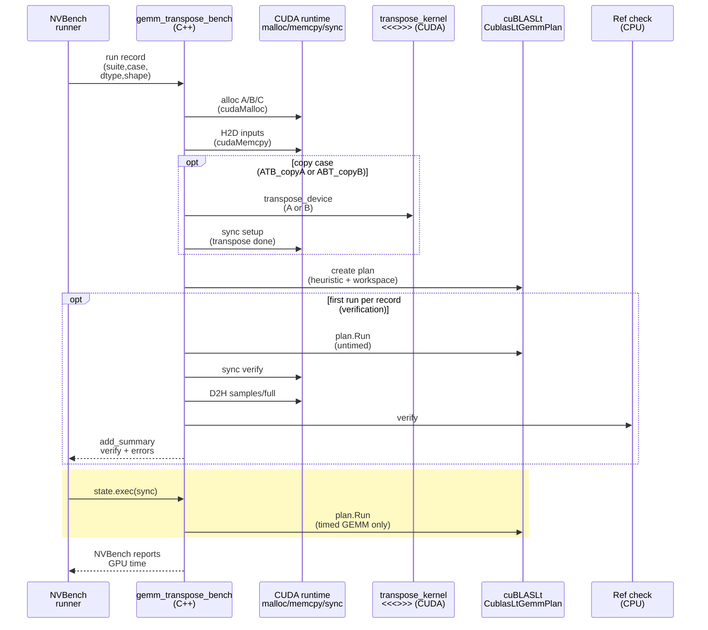

# GEMM Transpose Sweep - Stakeholder Report

- Run ID: `gemm_transpose_full_sweep_20260205_041151`
- Artifacts: `reports/transpose_matmul/gemm_transpose_full_sweep_20260205_041151/`
- Git: `main` @ `7c44854aec96ac066990bb3151978fced52152d9` (dirty: `True`)
- Time window (UTC): `2026-02-05T04:23:22Z` -> `2026-02-05T04:30:10Z`
- GPU: `NVIDIA B200` (sm_1000), driver `570.172.08`
- CUDA toolkit (Pixi): `12.8` (nvcc `V12.8.93`)
- Pixi env: `cuda128`
- NVBench: `0.1.0` (git `a29748316d21483929b3fadf65ed44ea29aeadee`, source: `extern/orphan/nvbench`)
- NVBench settings: `{'max_noise_pct': 0.3, 'min_samples': 20, 'min_time_s': 0.5, 'stopping_criterion': 'stdrel'}`
- Sweep size: 525 records (`square`: 325, `nonsquare_atb`: 100, `nonsquare_abt`: 100)
- Measurement scope: **GEMM-only** timing; transpose materialization for `*_copy*` cases is intentionally **outside** the timed region.

## Executive Summary

- Full sweep completed successfully on B200 (`results.json.run.status=pass`; verification passed for all 525 records).
- On B200, cuBLASLt algorithm selection is **mostly stable** across transpose-as-view vs transpose-as-copy: only **2 / 65** square `(N,dtype)` groups had any `algo_id` change between cases (square `N=896` fp32 default; square `N=1000` int8), and non-square suites showed no `view` vs `copy` algo flips for int8.
- The earlier A100 "int8 transpose-B view is dramatically faster" behavior **does not reproduce** at large sizes on B200. For `N=4096` int8, all cases use `algo_id=71` with nearly identical times.
- One notable boundary still exists: for **square `N=1000` int8**, `ABT_view` selects a different algo (`algo_id=23`) and is ~2.3x faster than `AB` (but note: `A@B.T` is a different math result than `A@B` unless `B` is symmetric).

## Key Results (curated)

Times below are from `report.md` (ms; `algo_id` is per-case cuBLASLt heuristic selection).

### Square Snapshots (B200)

#### N=4096

| dtype_pair | A@B(ms) (algo_id) | A.T@B(ms) (algo_id) | A@B.T(ms) (algo_id) | copy(A.T)@B(ms) (algo_id) | A@copy(B.T)(ms) (algo_id) |
|---|---:|---:|---:|---:|---:|
| `bf16,bf16->bf16 (fp32,default)` | 0.096 (66) | 0.096 (66) | 0.096 (66) | 0.096 (66) | 0.096 (66) |
| `fp16,fp16->fp16 (fp32,default)` | 0.100 (66) | 0.099 (66) | 0.099 (66) | 0.099 (66) | 0.100 (66) |
| `fp32,fp32->fp32 (fp32,default)` | 2.170 (76) | 2.317 (76) | 2.413 (76) | 2.170 (76) | 2.170 (76) |
| `fp32,fp32->fp32 (tf32,tf32)` | 0.195 (73) | 0.187 (73) | 0.188 (73) | 0.196 (73) | 0.196 (73) |
| `int8,int8->int32 (int32,default)` | 0.058 (71) | 0.058 (71) | 0.058 (71) | 0.058 (71) | 0.058 (71) |

#### N=2048

| dtype_pair | A@B(ms) (algo_id) | A.T@B(ms) (algo_id) | A@B.T(ms) (algo_id) | copy(A.T)@B(ms) (algo_id) | A@copy(B.T)(ms) (algo_id) |
|---|---:|---:|---:|---:|---:|
| `bf16,bf16->bf16 (fp32,default)` | 0.024 (66) | 0.023 (66) | 0.024 (66) | 0.023 (66) | 0.023 (66) |
| `fp16,fp16->fp16 (fp32,default)` | 0.024 (66) | 0.024 (66) | 0.024 (66) | 0.024 (66) | 0.024 (66) |
| `fp32,fp32->fp32 (fp32,default)` | 0.315 (76) | 0.303 (76) | 0.316 (76) | 0.315 (76) | 0.315 (76) |
| `fp32,fp32->fp32 (tf32,tf32)` | 0.038 (73) | 0.038 (73) | 0.038 (73) | 0.038 (73) | 0.038 (73) |
| `int8,int8->int32 (int32,default)` | 0.023 (71) | 0.023 (71) | 0.023 (71) | 0.023 (71) | 0.023 (71) |

#### N=1024

| dtype_pair | A@B(ms) (algo_id) | A.T@B(ms) (algo_id) | A@B.T(ms) (algo_id) | copy(A.T)@B(ms) (algo_id) | A@copy(B.T)(ms) (algo_id) |
|---|---:|---:|---:|---:|---:|
| `bf16,bf16->bf16 (fp32,default)` | 0.014 (66) | 0.014 (66) | 0.014 (66) | 0.014 (66) | 0.014 (66) |
| `fp16,fp16->fp16 (fp32,default)` | 0.014 (66) | 0.014 (66) | 0.014 (66) | 0.014 (66) | 0.014 (66) |
| `fp32,fp32->fp32 (fp32,default)` | 0.053 (76) | 0.053 (76) | 0.055 (76) | 0.054 (76) | 0.054 (76) |
| `fp32,fp32->fp32 (tf32,tf32)` | 0.019 (73) | 0.019 (73) | 0.020 (73) | 0.019 (73) | 0.019 (73) |
| `int8,int8->int32 (int32,default)` | 0.019 (71) | 0.019 (71) | 0.019 (71) | 0.019 (71) | 0.019 (71) |

### Square Algo Flips (B200)

Only the following square sizes have any `algo_id` differences across cases in this run (highlighted in **bold**):

| N | dtype_pair | AB(ms) (algo) | ATB_view(ms) (algo) | ABT_view(ms) (algo) | ATB_copyA(ms) (algo) | ABT_copyB(ms) (algo) |
|---:|---|---:|---:|---:|---:|---:|
| 896 | `fp32,fp32->fp32 (fp32,default)` | 0.048 (76) | **0.047 (20)** | 0.049 (76) | 0.048 (76) | 0.048 (76) |
| 1000 | `int8,int8->int32 (int32,default)` | 0.045 (64) | 0.047 (64) | **0.020 (23)** | 0.045 (64) | 0.045 (64) |

### A Small-Shape Algo Flip (Square N=1000, int8)

At `N=1000` with int8, `ABT_view` picks a different cuBLASLt algo than the other cases:

| case | time(ms) | algo_id |
|---|---:|---:|
| `AB` | 0.045 | 64 |
| `ATB_view` | 0.047 | 64 |
| `ABT_view` | **0.020** | **23** |
| `ATB_copyA` | 0.045 | 64 |
| `ABT_copyB` | 0.045 | 64 |

Interpretation caveat: for square matrices, `A@B.T` is **not** a drop-in replacement for `A@B` unless `B` is symmetric. This row primarily demonstrates that transpose flags/layout can unlock different kernels at specific sizes.

### Standalone Repro (N=1000, int8; algo 23)

To validate the "ABT_view + algo 23 is much faster" phenomenon outside the sweep harness, we added a minimal standalone repro:

- Program: `cpp/src/repro_algo23_int8_n1000.cu` (CMake target: `repro_algo23_int8_n1000`)
- Command:

```bash
pixi run -e cuda128 bash -lc ./cpp/build/Release/repro_algo23_int8_n1000
```

Timing method: CUDA events around a tight loop of `plan.Run(...)` calls (200 warmup + 2000 iters), reporting average GPU ms per GEMM.

Results (this machine; B200; CUDA 12.8):

| variant | avg_gpu_ms | algo_id | outcome |
|---|---:|---:|---|
| `AB` (heuristic) | 0.0348 | 64 | baseline |
| `ATB_view` (heuristic) | 0.0391 | 64 | baseline |
| `ABT_view` (heuristic) | **0.0123** | **23** | **2.83x faster vs AB** |
| `AB` (forced algo 23) | NA | 23 | rejected by `cublasLtMatmulAlgoCheck` (status 15) |
| `ATB_view` (forced algo 23) | NA | 23 | rejected by `cublasLtMatmulAlgoCheck` (status 15) |
| `ABT_view` (forced algo 23) | 0.0123 | 23 | matches heuristic fast path |
| `ABT_view` (forced algo 64) | 0.0246 | 64 | slower than algo 23 |

Interpretation:

- The speedup is reproducible with a standalone program: `ABT_view` heuristically selects **algo 23** and is much faster than `AB`/`ATB_view` (algo 64).
- For this `(M,N,K)=(1000,1000,1000)` int8 problem, cuBLASLt rejects forcing algo 23 for `AB` and `ATB_view` via `cublasLtMatmulAlgoCheck` (status 15), so those rows are **NA**.
- Absolute timings differ from the NVBench sweep (different harness and iteration strategy), but the key effect (algo 23 fast path for `ABT_view`) remains.

### Non-square Suite (FLOP-matched; view vs copy)

Non-square timing is split into two suites with **different storage shapes** (so the transpose-view expressions are well-defined for non-square matrices):

- `nonsquare_atb`: store `A` as `(K,M)` and `B` as `(K,N)`, then measure `A.T@B` (view) and `copy(A.T)@B` (copy).
- `nonsquare_abt`: store `A` as `(M,K)` and `B` as `(N,K)`, then measure `A@B.T` (view) and `A@copy(B.T)` (copy).

For copy cases, the transposed operand is materialized **outside** the timed region, so these tables remain **GEMM-only** (transpose materialization is intentionally excluded).

Full non-square details for all dtypes live in `report.md` (the `Non-square Suite` table) and in `all_timings.md` (complete per-record dump).

#### `nonsquare_atb` (int8): `A.T@B` vs `copy(A.T)@B`

| shape (MxNxK) | view(ms) (algo) | copy(ms) (algo) | view/copy |
|---|---:|---:|---:|
| `256x256x992` | 0.01778 (71) | 0.018089 (71) | 0.982911 |
| `256x992x256` | 0.016225 (71) | 0.016046 (71) | 1.011118 |
| `960x320x640` | 0.017182 (71) | 0.016888 (71) | 1.017379 |
| `992x256x256` | 0.016123 (71) | 0.015995 (71) | 1.00799 |
| `1024x1024x4096` | 0.024238 (71) | 0.024201 (71) | 1.001517 |
| `1024x4096x1024` | 0.018461 (71) | 0.018454 (71) | 1.000394 |
| `2304x1536x1536` | 0.019821 (71) | 0.020042 (71) | 0.988976 |
| `3072x2048x2048` | 0.02657 (71) | 0.02699 (71) | 0.984453 |
| `4096x1024x1024` | 0.01853 (71) | 0.018931 (71) | 0.978824 |
| `8192x1024x1024` | 0.022334 (71) | 0.022542 (71) | 0.990745 |

#### `nonsquare_abt` (int8): `A@B.T` vs `A@copy(B.T)`

| shape (MxNxK) | view(ms) (algo) | copy(ms) (algo) | view/copy |
|---|---:|---:|---:|
| `256x256x992` | 0.018159 (71) | 0.018019 (71) | 1.007774 |
| `256x992x256` | 0.01608 (71) | 0.016034 (71) | 1.002887 |
| `960x320x640` | 0.017466 (71) | 0.016812 (71) | 1.038914 |
| `992x256x256` | 0.016035 (71) | 0.015988 (71) | 1.002973 |
| `1024x1024x4096` | 0.024332 (71) | 0.024184 (71) | 1.006125 |
| `1024x4096x1024` | 0.018968 (71) | 0.01851 (71) | 1.02475 |
| `1536x2304x1536` | 0.020072 (71) | 0.020053 (71) | 1.000954 |
| `2048x3072x2048` | 0.027807 (71) | 0.027105 (71) | 1.025888 |
| `4096x1024x1024` | 0.018838 (71) | 0.018595 (71) | 1.013025 |
| `8192x1024x1024` | 0.023033 (71) | 0.022824 (71) | 1.00918 |

#### `nonsquare_atb` (TF32): `A.T@B` vs `copy(A.T)@B`

| shape (MxNxK) | view(ms) (algo) | copy(ms) (algo) | view/copy |
|---|---:|---:|---:|
| `256x256x992` | 0.016136 (73) | 0.016337 (73) | 0.987671 |
| `256x992x256` | 0.011321 (21) | 0.011405 (21) | 0.992588 |
| `960x320x640` | 0.015972 (73) | 0.015901 (73) | 1.004478 |
| `992x256x256` | 0.011587 (21) | 0.011545 (21) | 1.003586 |
| `1024x1024x4096` | 0.028672 (73) | 0.030037 (73) | 0.954566 |
| `1024x4096x1024` | 0.026687 (73) | 0.026515 (73) | 1.006487 |
| `2304x1536x1536` | 0.031079 (73) | 0.031355 (73) | 0.991208 |
| `3072x2048x2048` | 0.049641 (73) | 0.050961 (73) | 0.974093 |
| `4096x1024x1024` | 0.027084 (73) | 0.027003 (73) | 1.002989 |
| `8192x1024x1024` | 0.039257 (73) | 0.039354 (73) | 0.997522 |

#### `nonsquare_abt` (TF32): `A@B.T` vs `A@copy(B.T)`

| shape (MxNxK) | view(ms) (algo) | copy(ms) (algo) | view/copy |
|---|---:|---:|---:|
| `256x256x992` | 0.016024 (73) | 0.016198 (73) | 0.989206 |
| `256x992x256` | 0.011489 (21) | 0.011392 (21) | 1.008453 |
| `960x320x640` | 0.01595 (73) | 0.015869 (73) | 1.00512 |
| `992x256x256` | 0.011558 (21) | 0.011624 (21) | 0.994306 |
| `1024x1024x4096` | 0.030786 (73) | 0.029558 (73) | 1.041534 |
| `1024x4096x1024` | 0.027479 (73) | 0.026664 (73) | 1.030567 |
| `1536x2304x1536` | 0.0318 (73) | 0.03115 (73) | 1.020863 |
| `2048x3072x2048` | 0.050953 (73) | 0.051297 (73) | 0.993304 |
| `4096x1024x1024` | 0.027553 (73) | 0.027443 (73) | 1.003982 |
| `8192x1024x1024` | 0.039341 (73) | 0.039703 (73) | 0.99087 |

## Analysis

### What is actually being compared?

Each record measures **GEMM only**:

- `*_view` cases use cuBLASLt transpose flags (`trans_a`/`trans_b`) and pass the original device buffer.
- `*_copy*` cases materialize the transpose via a CUDA kernel **before timing**, then run GEMM with `trans_* = N`.

So "view vs copy" is primarily comparing **operand layout + cuBLASLt kernel/config selection**, not the cost of transposing.

### Why do we care about algorithm IDs?

Even small differences in transpose flags/layout can change:

- which kernels are eligible,
- which kernel/config the heuristic picks,
- and therefore timing.

In this B200 run, the heuristic is mostly stable across cases (only 2 square groups show any `algo_id` flip), which explains why most view vs copy timings are close.

### Algorithms Observed (Caps Summary)

For this run, we dumped `cublasLtMatmulAlgoCapGetAttribute()` for every unique `(algo_id, dtype/config)` observed in `results.json` into:

- `cublaslt_algo_caps.json`

Summary table (one row per unique `(algo_id, types)`):

| algo_id | dtype_sig | records | splitk | tile_ids | stages_ids | epilogue_mask | pointer_mode_mask | min_align(A,B,C,D) |
|---:|---|---:|---:|---:|---:|---:|---:|---|
| `20` | `fp32,fp32->fp32(fp32)` | 5 | 1 | 8 | 2 | `1023` | `3` | `4,4,4,4` |
| `21` | `fp32,fp32->fp32(tf32)` | 8 | 1 | 8 | 12 | `1023` | `3` | `16,16,16,16` |
| `23` | `int8,int8->int32(int32)` | 1 | 1 | 6 | 6 | `1` | `3` | `4,4,4,4` |
| `64` | `int8,int8->int32(int32)` | 4 | 1 | 1 | 1 | `1` | `3` | `4,4,4,4` |
| `66` | `bf16,bf16->bf16(fp32)` | 105 | 1 | 634 | 1 | `1023` | `3` | `16,16,16,16` |
| `66` | `fp16,fp16->fp16(fp32)` | 105 | 1 | 634 | 1 | `1023` | `3` | `16,16,16,16` |
| `71` | `int8,int8->int32(int32)` | 100 | 1 | 6 | 1 | `1023` | `3` | `16,16,16,16` |
| `73` | `fp32,fp32->fp32(tf32)` | 97 | 1 | 5 | 1 | `1023` | `3` | `16,16,16,16` |
| `76` | `fp32,fp32->fp32(fp32)` | 100 | 1 | 7 | 1 | `1023` | `3` | `4,4,4,4` |

Notes:

| column | what it means (high level) | where it comes from |
|---|---|---|
| `algo_id` | cuBLASLt algorithm ID reported by our benchmark (`record.cublaslt.algo.id`). It is an identifier, not a stable human-readable kernel name. | `results.json` export |
| `dtype_sig` | Shorthand for the math mode this row came from, derived from an example record: `A,B->C(compute)` (e.g. `fp32,fp32->fp32(tf32)`). | `results.json` export |
| `records` | Number of benchmark records (rows in `results.json`) that used this exact `(algo_id + A/B/C/D types + compute_type + scale_type)` combination. | derived from `results.json` |
| `splitk` | Whether the algo supports split-K GEMM: split the K dimension into multiple independent partial GEMMs, then reduce/accumulate partials into `C`. Can help utilization for some shapes; typically needs workspace and a reduction step. | cap: `CUBLASLT_ALGO_CAP_SPLITK_SUPPORT` |
| `tile_ids` | Count of supported threadblock "tile" configurations for this algo (coarse MxN blocking of C and the K chunk it marches over). We show the count; the ID list is in `cublaslt_algo_caps.json`. | cap: `CUBLASLT_ALGO_CAP_TILE_IDS` |
| `stages_ids` | Count of supported pipeline stage configurations (software-pipelining depth that overlaps memory and MMA/compute). We show the count; the ID list is in `cublaslt_algo_caps.json`. | cap: `CUBLASLT_ALGO_CAP_STAGES_IDS` |
| `epilogue_mask` | Bitmask of supported fused epilogues (post-matmul ops the algo can fuse, e.g. bias/activation variants depending on path). This is capability only; this benchmark uses the default/no-fused-postop path. | cap: `CUBLASLT_ALGO_CAP_EPILOGUE_MASK` |
| `pointer_mode_mask` | Bitmask of supported alpha/beta pointer locations (host vs device). This benchmark uses host pointers for alpha/beta. | cap: `CUBLASLT_ALGO_CAP_POINTER_MODE_MASK` |
| `min_align(A,B,C,D)` | Minimum required base-pointer alignment (bytes) for A/B/C/D for this algo to be eligible. Violating this (or misaligning sub-alloc offsets) can make an algo unusable and force a different selection. | caps: `CUBLASLT_ALGO_CAP_MIN_ALIGNMENT_A_BYTES`, `CUBLASLT_ALGO_CAP_MIN_ALIGNMENT_B_BYTES`, `CUBLASLT_ALGO_CAP_MIN_ALIGNMENT_C_BYTES`, `CUBLASLT_ALGO_CAP_MIN_ALIGNMENT_D_BYTES` |

These fields are algorithm *capabilities* (what is allowed), not per-run selections (we do not record which specific tile/stage was chosen for a given record).

## Correctness & Verification (critical path)

### Timed region and GEMM launch

The GEMM work is launched through:

- `plan.Run(launch.get_stream(), a_used, b_used, c_dev, &alpha, &beta);` (`cpp/src/gemm_transpose_bench.cu:1081`)

which ultimately dispatches cuBLASLt:

- `cublasLtMatmul(...)` (`cpp/src/cublaslt_gemm.cu:198`)

### Timing Brackets (What Is Timed?)

The benchmark reports **GEMM-only** GPU time from NVBench's `state.exec(...)` region. All of the following happen **outside** the timed bracket:

- host input generation
- `cudaMalloc` / `cudaMemcpy` H2D for A/B/C
- transpose materialization for `*_copy*` cases (`transpose_device(...)` + sync)
- the one-time correctness verification run + D2H copies for checking



### View vs copy semantics (what buffers are passed into cuBLASLt)

Case selection is implemented in `cpp/src/gemm_transpose_bench.cu`:

- View flags: `ABT_view` sets `trans_b=CUBLAS_OP_T`, `ATB_view` sets `trans_a=CUBLAS_OP_T` (`cpp/src/gemm_transpose_bench.cu:815`).
- Copy cases materialize the transpose before timing via:
  - `transpose_kernel<<<...>>>(...)` (`cpp/src/gemm_transpose_bench.cu:62`)
  - then set `a_used` / `b_used` to the copied buffer (`cpp/src/gemm_transpose_bench.cu:863`, `cpp/src/gemm_transpose_bench.cu:903`).

### Algorithm recording (export contract)

We persist the selected cuBLASLt algorithm/config into NVBench summaries:

- `state.add_summary("accelsim/cublaslt/algo")` (`cpp/src/gemm_transpose_bench.cu:928`)

The Python exporter lifts this into `results.json` under `record.cublaslt.algo`.

### Verification policy

- One **untimed** GEMM run is performed for correctness checks (`cpp/src/gemm_transpose_bench.cu:943`).
- Full verification when `max(M,N,K) <= 1000`; otherwise sampled indices (see `full_verify` logic in `cpp/src/gemm_transpose_bench.cu:966`).
- For fp16/bf16/TF32, the reference path quantizes inputs to match compute precision (avoids false mismatches) (`cpp/src/gemm_transpose_bench.cu:1008` onward).

## Questions & Answers

**Q: "How is CUDA memory allocated for inputs, and how does data move from host to GPU?"**

**A:** This benchmark allocates **pageable host buffers** (`std::vector<...>`) and **device buffers** via `cudaMalloc`, then uses `cudaMemcpy` to move inputs to the GPU. There is no explicit pinned-host allocation in the benchmark.

Host-side inputs are generated as `std::vector<float>` (fp16/bf16/fp32 paths) or `std::vector<int8_t>` (int8 path):

```cpp
// Allocate and initialize host matrices.
const int seed = 123;
std::vector<float> a_host_f;
std::vector<float> b_host_f;
std::vector<std::int8_t> a_host_i8;
std::vector<std::int8_t> b_host_i8;

if (dtype.is_int)
{
  a_host_i8 = make_host_matrix_int8(a_rows, a_cols, seed);
  b_host_i8 = make_host_matrix_int8(b_rows, b_cols, seed + 1);
}
else
{
  a_host_f = make_host_matrix<float>(a_rows, a_cols, seed);
  b_host_f = make_host_matrix<float>(b_rows, b_cols, seed + 1);
}
```

Source: `cpp/src/gemm_transpose_bench.cu:709-725`.

Device memory is allocated with a tiny wrapper around `cudaMalloc`:

```cpp
void *device_alloc(std::size_t bytes)
{
  void *ptr = nullptr;
  CublasLtGemmPlan::CheckCuda(cudaMalloc(&ptr, bytes), "cudaMalloc");
  return ptr;
}
```

Source: `cpp/src/gemm_transpose_bench.cu:612-617`.

Then `A`, `B`, and `C` are allocated on device and populated via `cudaMemcpy`. For fp16/bf16, we first convert the host floats into temporary host vectors (`__half` / `__nv_bfloat16`) and then copy those buffers:

```cpp
a_dev = device_alloc(a_bytes);
b_dev = device_alloc(b_bytes);
c_dev = device_alloc(c_bytes);

// Copy inputs to device.
if (dtype.is_int)
{
  CublasLtGemmPlan::CheckCuda(cudaMemcpy(a_dev, a_host_i8.data(), a_bytes, cudaMemcpyHostToDevice), "cudaMemcpy(A)");
  CublasLtGemmPlan::CheckCuda(cudaMemcpy(b_dev, b_host_i8.data(), b_bytes, cudaMemcpyHostToDevice), "cudaMemcpy(B)");
}
else if (dtype.types.a_type == CUDA_R_16F)
{
  auto a_half = convert_to<__half>(a_host_f);
  auto b_half = convert_to<__half>(b_host_f);
  CublasLtGemmPlan::CheckCuda(cudaMemcpy(a_dev, a_half.data(), a_bytes, cudaMemcpyHostToDevice), "cudaMemcpy(A)");
  CublasLtGemmPlan::CheckCuda(cudaMemcpy(b_dev, b_half.data(), b_bytes, cudaMemcpyHostToDevice), "cudaMemcpy(B)");
}
// (bf16 and fp32 follow the same pattern)
```

Source: `cpp/src/gemm_transpose_bench.cu:751-794`.

Additional notes:

- The benchmark's reported "GPU time" is the GEMM kernel timing; these allocations and `cudaMemcpy` calls happen outside the timed region.
- Copy-case buffers `a_copy_dev` / `b_copy_dev` (materialized transposes) are also allocated via `device_alloc(...)` before timing (`cpp/src/gemm_transpose_bench.cu:832-905`).
- cuBLASLt per-plan workspace is allocated with `cudaMalloc` inside the plan object (`cpp/src/cublaslt_gemm.cu:154`) and freed in the destructor (`cpp/src/cublaslt_gemm.cu:157-163`).

If you specifically meant "pinned memory": that usually refers to **page-locked host memory** to speed up H2D/D2H transfers and enable truly asynchronous `cudaMemcpyAsync`. The usual CUDA patterns are:

```cpp
void *h = nullptr;
cudaMallocHost(&h, bytes);          // or: cudaHostAlloc(&h, bytes, cudaHostAllocDefault);
// fill h...
cudaMemcpyAsync(d, h, bytes, cudaMemcpyHostToDevice, stream);
cudaFreeHost(h);
```

Or, to pin an existing host allocation (advanced; lifetime/alignment caveats apply):

```cpp
cudaHostRegister(ptr, bytes, cudaHostRegisterDefault);
// use ptr for async copies...
cudaHostUnregister(ptr);
```

**Q: "How is CUDA memory aligned?"**

**A:** In this benchmark we do not manually pad or align buffers. For this run (CUDA Toolkit 12.8 on NVIDIA B200), we rely on the CUDA allocation guarantees plus cuBLASLt's per-algorithm requirements:

- CUDA C++ Programming Guide (12.8) states that any address returned by the driver/runtime allocation routines is aligned to at least **256 bytes**. This includes pointers returned by `cudaMalloc`.
- CUDA Runtime API (12.8) describes `cudaMalloc` as returning memory "suitably aligned for any kind of variable".
- cuBLASLt algorithms can impose additional minimum alignment constraints for the A/B/C/D base pointers; those are queryable via `cublasLtMatmulAlgoCapGetAttribute()` and are recorded for this run in `cublaslt_algo_caps.json` as `min_align(A,B,C,D)` (from `CUBLASLT_ALGO_CAP_MIN_ALIGNMENT_{A,B,C,D}_BYTES`).

Practical implications for this benchmark:

- Our base device buffers (`a_dev`, `b_dev`, `c_dev`) come from `cudaMalloc`, so their base addresses are >=256B aligned.
- Transpose-as-view does not change the pointer value (only the cuBLASLt transpose flag and leading dimensions), so the base-pointer alignment remains the same.
- If we ever switch to a "single big cudaMalloc + sub-allocate by offset" scheme, we must ensure every sub-buffer start address preserves the required alignment. Offset pointers can break alignment even if the original `cudaMalloc` base is aligned.
- In this run, observed cuBLASLt minimum alignments were 4B or 16B (see `min_align(A,B,C,D)` in the caps table), which are trivially satisfied by the >=256B `cudaMalloc` base alignment unless we introduce misaligned offsets.

Refs (for this run's toolkit): CUDA C++ Programming Guide 12.8 ("Device Memory Accesses"); CUDA Runtime API 12.8 (`cudaMalloc`).

## Reproduction

```bash
# Build
pixi install -e cuda128
pixi run -e cuda128 gemm-transpose-build

# Run sweep
out_dir=/data/ssd1/huangzhe/code/accelsim-test/reports/transpose_matmul/gemm_transpose_full_sweep_20260205_041151
pixi run -e cuda128 gemm-transpose sweep --out-dir "$out_dir"

# Generate Markdown reports (no re-run)
pixi run -e cuda128 gemm-transpose report --out-dir "$out_dir"
```

## Appendix

- Generated summary: `report.md`
- Full timing table: `all_timings.md`
- Normalized export: `results.json`
- Raw NVBench JSON: `raw/`
