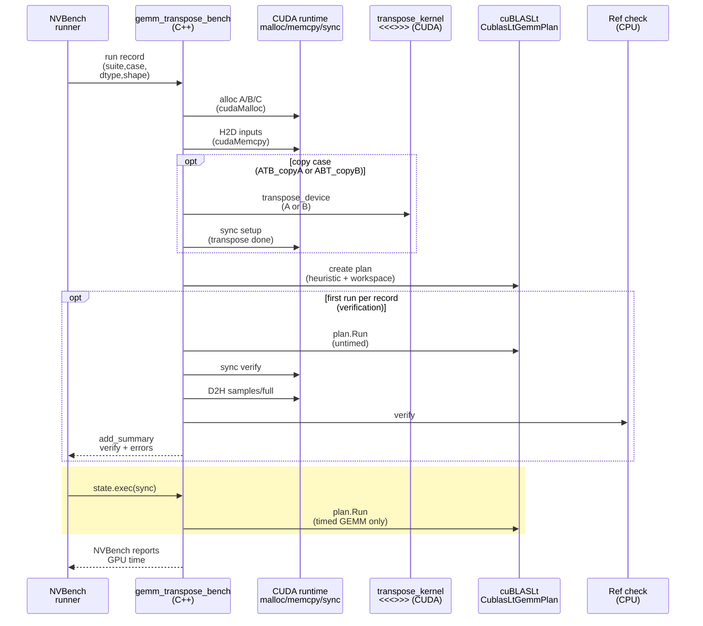

# GEMM Transpose Sweep - Stakeholder Report

- Run ID: `gemm_transpose_full_sweep_20260209_025629`
- Artifacts: `reports/transpose_matmul/gemm_transpose_full_sweep_20260209_025629/`
- Git: `main` @ `d7adcb64cccb1819938fd5016f0872cc8693fcd5` (dirty: `True`)
- Time window (UTC): `2026-02-09T03:08:08.770539Z` -> `2026-02-09T03:14:51.878065Z`
- GPU: `NVIDIA B200` (sm_1000), driver `590.48.01`
- CUDA toolkit (Pixi): `13.0` (nvcc `V13.0.88`)
- Pixi env: `cuda13`
- NVBench: `0.1.0` (git `a29748316d21483929b3fadf65ed44ea29aeadee`, source: `extern/orphan/nvbench`)
- NVBench settings: `{'max_noise_pct': 0.3, 'min_samples': 20, 'min_time_s': 0.5, 'stopping_criterion': 'stdrel'}`
- Sweep size: 525 records (`square`: 325, `nonsquare_atb`: 100, `nonsquare_abt`: 100)
- Measurement scope: **GEMM-only** timing; transpose materialization for `*_copy*` cases is intentionally **outside** the timed region.

## Executive Summary

- Full sweep completed successfully on B200 (`results.json.run.status=pass`; verification passed for all 525 records).
- On B200 (CUDA 13.0), cuBLASLt algorithm selection is **mostly stable** across transpose-as-view vs transpose-as-copy: only **2 / 65** square `(N,dtype)` groups had any `algo_id` change between cases, and non-square suites showed no `view` vs `copy` algo flips.
- The earlier A100 "int8 transpose-B view is dramatically faster" behavior **does not reproduce** at large sizes on B200. For `N=4096` int8, all cases use `algo_id=71` with nearly identical times.
- One notable boundary still exists: for **square `N=1000` int8**, `ABT_view` selects a different algo (`algo_id=23`) and is ~2.4x faster than `AB` (but note: `A@B.T` is a different math result than `A@B` unless `B` is symmetric).

## Key Results (curated)

Times below are from `report.md` (ms; `algo_id` is per-case cuBLASLt heuristic selection).

### Square Snapshots (B200)

#### Dtype Signature Legend

Throughout this report, dtype labels use the shorthand:

`a,b->c (compute,math_mode)`

This corresponds to `record.dtype.{a,b,c,compute,math_mode}` in `results.json`.

#### N=4096

| dtype_pair | A@B(ms) (algo_id) | A.T@B(ms) (algo_id) | A@B.T(ms) (algo_id) | copy(A.T)@B(ms) (algo_id) | A@copy(B.T)(ms) (algo_id) |
|---|---:|---:|---:|---:|---:|
| `bf16,bf16->bf16 (fp32,default)` | 0.096 (66) | 0.095 (66) | 0.096 (66) | 0.096 (66) | 0.096 (66) |
| `fp16,fp16->fp16 (fp32,default)` | 0.100 (66) | 0.099 (66) | 0.100 (66) | 0.100 (66) | 0.100 (66) |
| `fp32,fp32->fp32 (fp32,default)` | 2.171 (76) | 2.322 (76) | 2.430 (76) | 2.171 (76) | 2.171 (76) |
| `fp32,fp32->fp32 (tf32,tf32)` | 0.195 (73) | 0.189 (73) | 0.190 (73) | 0.195 (73) | 0.195 (73) |
| `int8,int8->int32 (int32,default)` | 0.057 (71) | 0.057 (71) | 0.058 (71) | 0.057 (71) | 0.057 (71) |

#### N=2048

| dtype_pair | A@B(ms) (algo_id) | A.T@B(ms) (algo_id) | A@B.T(ms) (algo_id) | copy(A.T)@B(ms) (algo_id) | A@copy(B.T)(ms) (algo_id) |
|---|---:|---:|---:|---:|---:|
| `bf16,bf16->bf16 (fp32,default)` | 0.023 (66) | 0.023 (66) | 0.024 (66) | 0.023 (66) | 0.023 (66) |
| `fp16,fp16->fp16 (fp32,default)` | 0.023 (66) | 0.023 (66) | 0.024 (66) | 0.024 (66) | 0.023 (66) |
| `fp32,fp32->fp32 (fp32,default)` | 0.314 (76) | 0.303 (76) | 0.319 (76) | 0.314 (76) | 0.314 (76) |
| `fp32,fp32->fp32 (tf32,tf32)` | 0.037 (73) | 0.037 (73) | 0.037 (73) | 0.037 (73) | 0.037 (73) |
| `int8,int8->int32 (int32,default)` | 0.022 (71) | 0.022 (71) | 0.023 (71) | 0.022 (71) | 0.022 (71) |

#### N=1024

| dtype_pair | A@B(ms) (algo_id) | A.T@B(ms) (algo_id) | A@B.T(ms) (algo_id) | copy(A.T)@B(ms) (algo_id) | A@copy(B.T)(ms) (algo_id) |
|---|---:|---:|---:|---:|---:|
| `bf16,bf16->bf16 (fp32,default)` | 0.014 (66) | 0.013 (66) | 0.014 (66) | 0.014 (66) | 0.013 (66) |
| `fp16,fp16->fp16 (fp32,default)` | 0.014 (66) | 0.013 (66) | 0.013 (66) | 0.013 (66) | 0.013 (66) |
| `fp32,fp32->fp32 (fp32,default)` | 0.053 (76) | 0.053 (76) | 0.055 (76) | 0.053 (76) | 0.053 (76) |
| `fp32,fp32->fp32 (tf32,tf32)` | 0.018 (73) | 0.018 (73) | 0.019 (73) | 0.018 (73) | 0.018 (73) |
| `int8,int8->int32 (int32,default)` | 0.018 (71) | 0.019 (71) | 0.019 (71) | 0.018 (71) | 0.018 (71) |

### Square Algo Flips (B200)

Only the following square sizes have any `algo_id` differences across cases in this run (highlighted in **bold**):

| N | dtype_pair | AB(ms) (algo) | ATB_view(ms) (algo) | ABT_view(ms) (algo) | ATB_copyA(ms) (algo) | ABT_copyB(ms) (algo) |
|---:|---|---:|---:|---:|---:|---:|
| 896 | `fp32,fp32->fp32 (fp32,default)` | 0.048 (76) | **0.046 (20)** | 0.049 (76) | 0.048 (76) | 0.048 (76) |
| 1000 | `int8,int8->int32 (int32,default)` | 0.045 (64) | 0.047 (64) | **0.019 (23)** | 0.045 (64) | 0.045 (64) |

### A Small-Shape Algo Flip (Square N=1000, int8)

At `N=1000` with int8, `ABT_view` picks a different cuBLASLt algo than the other cases:

| case | time(ms) | algo_id |
|---|---:|---:|
| `AB` | 0.045 | 64 |
| `ATB_view` | 0.047 | 64 |
| `ABT_view` | **0.019** | **23** |
| `ATB_copyA` | 0.045 | 64 |
| `ABT_copyB` | 0.045 | 64 |

Interpretation caveat: for square matrices, `A@B.T` is **not** a drop-in replacement for `A@B` unless `B` is symmetric. This row primarily demonstrates that transpose flags/layout can unlock different kernels at specific sizes.

### Standalone Repro (N=1000, int8; algo 23)

To validate the "ABT_view + algo 23 is much faster" phenomenon outside the sweep harness, we added a minimal standalone repro:

- Program: `cpp/src/repro_algo23_int8_n1000.cu` (CMake target: `repro_algo23_int8_n1000`)
- Command:

```bash
pixi run -e cuda13 bash -lc ./cpp/build/Release/repro_algo23_int8_n1000
```

Timing method: CUDA events around a tight loop of `plan.Run(...)` calls (200 warmup + 2000 iters), reporting average GPU ms per GEMM.

Results (this machine; B200; CUDA 13.0): see `repro_algo23_int8_n1000.txt` for the raw output.

| variant | avg_gpu_ms | algo_id | outcome |
|---|---:|---:|---|
| `AB` (heuristic) | 0.0328 | 64 | baseline |
| `ATB_view` (heuristic) | 0.0409 | 64 | baseline |
| `ABT_view` (heuristic) | **0.0123** | **23** | **2.67x faster vs AB** |
| `AB` (forced algo 23) | NA | 23 | rejected by `cublasLtMatmulAlgoCheck` (status 15) |
| `ATB_view` (forced algo 23) | NA | 23 | rejected by `cublasLtMatmulAlgoCheck` (status 15) |
| `ABT_view` (forced algo 23) | 0.0123 | 23 | matches heuristic fast path |
| `ABT_view` (forced algo 64) | 0.0238 | 64 | slower than algo 23 |

Interpretation:

- The speedup is reproducible with a standalone program: `ABT_view` heuristically selects **algo 23** and is much faster than `AB`/`ATB_view` (algo 64).
- For this `(M,N,K)=(1000,1000,1000)` int8 problem, cuBLASLt rejects forcing algo 23 for `AB` and `ATB_view` via `cublasLtMatmulAlgoCheck` (status 15), so those rows are **NA**.
- Absolute timings differ from the NVBench sweep (different harness and iteration strategy), but the key effect (algo 23 fast path for `ABT_view`) remains.

### algo 23 vs algo 64

For square `N=1000` with int8, `ABT_view` selects `algo_id=23` and is much faster than the `algo_id=64` family used by `AB` / `ATB_view`. This section summarizes (1) **what kernels are actually executing** and the key implementation differences, and (2) **why `algo_id=23` is only eligible for certain transpose/layout combinations**.

#### 1) Kernel differences (nsys) and what the names imply

We attached a standalone profiling bundle under this report directory:

- Fast path (`ABT_view` forced `algo_id=23`): `profiles/n1000_int8_abt_view_algo23/`
- Baseline (`ABT_view` forced `algo_id=64`): `profiles/n1000_int8_abt_view_algo64/`

From `nsys` kernel discovery (`profiles/.../nsys/kernel_list.csv`), the timed GEMM kernel differs. This is not a “small knob tweak”: the algo flip changes the executed CUTLASS kernel family, launch configuration, and (as shown by `ncu`) instruction mix.

What the names imply (grounded in CUTLASS conventions; see `extern/orphan/cutlass/`):

Kernel used (nsys; abridged):

- `algo_id=23`: `cutlass::Kernel2<cutlass_80_tensorop_i16832gemm_s8_128x64_128x3_tn_align4>(...)`
- `algo_id=64`: `cutlass::Kernel2<cutlass_80_wmma_tensorop_i161616gemm_s8_forwardCompat_128x128_32x2_tn_align4>(...)`

Evidence: `profiles/.../nsys/kernel_list.csv`

| Aspect | `algo_id=23` | `algo_id=64` | Implication |
|---|---|---|---|
| Launch (nsys) | grid `128x1x1`, block `128x1x1` | grid `64x1x1`, block `256x1x1` | More CTAs and smaller blocks can reduce **underfill** and improve scheduling for small GEMMs. |
| Opcode class (from name) | `tensorop` | `wmma_tensorop` (`forwardCompat`) | Suggests different kernel “family”/constraints; `forwardCompat` variants tend to be more conservative. |
| Threadblock tile (M×N×K; from name) | `128x64x128` | `128x128x32` | Different per-CTA output tile shape and K chunk size (affects loop iterations and data movement). |
| Pipeline stages (from name) | `3` | `2` | More stages = deeper buffering of operand tiles, improving memory/compute overlap when layout/stride constraints are met. |
| Implied `TB_K` and K mainloop steps (K=1000) | `TB_K=128` → ~`ceil(1000/128)=8` | `TB_K=32` → ~`ceil(1000/32)=32` | ~4× fewer mainloop K-steps → fewer barriers/control instructions and less pipeline overhead. |
| Tensor Core MMA (SASS) | `IMMA.16832.S8.S8.SAT ...` | `IMMA.16816.S8.S8.SAT ...` | `IMMA.16832` performs 2× the K work per MMA vs `IMMA.16816`, reducing MMA instruction count for fixed K. |
| Global→shared staging (SASS) | `LDGSTS.E.LTC128B ...` present | no `LDGSTS` observed; uses `LDG.E.LTC128B ...` | `LDGSTS` enables direct global→shared staging (cp.async-style), which can reduce register staging and improve overlap with compute. |
| Shared-mem matrix loads (SASS) | `LDSM.16.M88.4 ...` | `LDSM.16.M88.2 ...` | Wider `LDSM` variants can fetch more matrix fragments per instruction, reducing instruction overhead feeding IMMA. |

Stages detail (why `3` vs `2`):

- In CUTLASS “multistage” kernels, `stages` is the depth of the shared-memory circular buffer for operand tiles (double-buffering for `2`, triple-buffering for `3`), used to overlap global→shared copies with IMMA compute.
- In `extern/orphan/cutlass/include/cutlass/gemm/threadblock/mma_blas3_multistage.h`, the pipeline uses `cp_async_wait<kStages - 2>`; `stages=3` corresponds to waiting for `1` group (leaving more in-flight work), while `stages=2` corresponds to waiting for `0` (draining), i.e., less opportunity to overlap.
- This deeper buffering costs shared memory: `ncu` Launch Statistics report higher dynamic shared memory per block for `algo_id=23` (73.73 KB) than `algo_id=64` (34.82 KB).
- For `algo_id=23`, the 73.73 KB value is consistent with “stages × (A_tile + B_tile)” in shared memory: `3 × (128×128×1B + 128×64×1B) = 73,728B ≈ 73.73 KB` (A/B are int8).
- Why `algo_id=23` has `stages=3`: it is the more aggressively pipelined kernel variant used in the “good-layout” (`ABT_view` / K-contiguous) case, where `LDGSTS` + larger `TB_K` can keep the IMMA pipeline fed.

Evidence / notes:

- Kernel name + launch dims: `profiles/.../nsys/kernel_list.csv`
- SASS: `ncu --import profiles/.../ncu/profile.ncu-rep --page source --print-source sass`
- CUTLASS name encoding / tile naming: `extern/orphan/cutlass/python/cutlass_library/library.py`
- WMMA wrappers: `extern/orphan/cutlass/include/cutlass/arch/wmma.h`
- Multistage `cp.async`-style mainloop: `extern/orphan/cutlass/include/cutlass/gemm/threadblock/mma_blas3_multistage.h`
- `ldmatrix` / `LDSM`: `extern/orphan/cutlass/include/cutlass/arch/memory_sm75.h`

#### 2) Kernel-level evidence (ncu; set=basic)

From `ncu` (`profiles/.../ncu/details.csv`, `--set basic`), key metrics for the main kernel are:

| metric | `algo_id=23` | `algo_id=64` |
|---|---:|---:|
| Duration | 22.59 us | 49.95 us |
| Compute (SM) Throughput | 15.01% | 12.49% |
| Memory Throughput | 44.98% | 21.70% |
| DRAM Throughput | 1.36% | 0.61% |
| L2 Cache Throughput | 9.14% | 5.03% |
| L1/TEX Cache Throughput | 71.75% | 59.24% |
| Grid size | 128 blocks | 64 blocks |
| Block size | 128 threads | 256 threads |
| Waves per SM | 0.29 | 0.22 |

Interpretation (evidence-backed, not speculative):

- `algo_id=23` is faster primarily because its kernel is ~2.2× shorter in duration (22.6us vs 50.0us).
- Both launches are under-filled (waves per SM << 1) due to the small GEMM size; in this regime, tile choice + grid size matter a lot. `algo_id=23` launches more CTAs (128 vs 64), which reduces underutilization.
- The throughput deltas (especially “Memory Throughput” and L1/L2) are consistent with “better feeding” of Tensor Core math for this specific TN int8 problem.
- The SASS differences above are consistent with this outcome: `IMMA.16832` (vs `IMMA.16816`) reduces the number of warp-level MMA steps needed for a fixed K, and `LDGSTS` enables more direct/pipelined global→shared staging than plain `LDG`.

Notes:

- The `ncu` captures use `--profile-from-start off` and `cudaProfilerStart/Stop` gating in the repro to isolate the timed GEMM region.
- For a longer-form decode of the kernel-name fields and additional discussion of likely drivers, see `kernel-difference-explain.md`.

#### 3) Why `algo_id=23` is not selectable in all cases (layout/stride constraints)

The fast `tensorop_i16832` family is only eligible when the *effective* operand access along the GEMM **K dimension** is “friendly” (unit-stride / aligned) for **both** operands. This aligns with the underlying MMA’s row/col operand expectations (e.g., `m16n8k32.row.col` in `extern/orphan/cutlass/include/cutlass/arch/mma_sm80.h`).

A practical way to reason about this is K-contiguity under `(order, transpose)`:

- A is K-contiguous iff:
  - `order_a=row` and `trans_a=N` (A[i,k] is unit-stride), **or**
  - `order_a=col` and `trans_a=T` (A^T[i,k] = A[k,i] is unit-stride).
- B is K-contiguous iff:
  - `order_b=row` and `trans_b=T` (B^T[k,n] = B[n,k] is unit-stride), **or**
  - `order_b=col` and `trans_b=N` (B[k,n] is unit-stride).

When these conditions are not met, cuBLASLt may reject the pinned algo configuration entirely (eligibility), and/or the heuristic will choose a different algorithm/kernel family.

#### 4) Proof: AlgoCheck rejection + layout-order focus experiment

1) **AlgoCheck rejection (eligibility signal)**  
   The standalone repro above shows cuBLASLt rejects forcing `algo_id=23` for `AB` and `ATB_view` under the default row-major layout via `cublasLtMatmulAlgoCheck` (`CUBLAS_STATUS_NOT_SUPPORTED`, status 15), while `ABT_view` accepts it.

2) **Layout-order focus experiment (selection shifts exactly when K-contiguity shifts)**  
   We ran a focused experiment that varies A/B storage order independently (including mixed cases) with **symmetric inputs** (so `AB`, `ATB_view`, `ABT_view` are “same math”) and records which `algo_id` is selected:

   - Artifacts: `reports/transpose_matmul/layout_order_focus_experiment_20260210_075753/` (see `report.md` / `results.csv`)

   Results (A/B order matrix; order_c=row):

   | order_a | order_b | variant | time (us) | algo_id | tile | stages |
   |--------:|--------:|---------|----------:|--------:|-----:|-------:|
   | col | col | AB | 27.13 | 64 | 20 | 8 |
   | col | col | ABT_view | 43.51 | 64 | 20 | 8 |
   | col | col | ATB_view | 12.29 | 23 | 18 | 21 |
   | col | row | AB | 40.91 | 64 | 20 | 8 |
   | col | row | ABT_view | 27.13 | 64 | 20 | 8 |
   | col | row | ATB_view | 32.79 | 64 | 20 | 8 |
   | row | col | AB | 12.29 | 23 | 18 | 21 |
   | row | col | ABT_view | 32.79 | 64 | 20 | 8 |
   | row | col | ATB_view | 27.22 | 64 | 20 | 8 |
   | row | row | AB | 32.79 | 64 | 20 | 8 |
   | row | row | ABT_view | 12.29 | 23 | 18 | 21 |
   | row | row | ATB_view | 40.92 | 64 | 20 | 8 |

   Observed “where algo 23 appears” (order_c=row):

   | order_a | order_b | variant selecting `algo_id=23` |
   |---:|---:|---|
   | row | row | `ABT_view` |
   | row | col | `AB` |
   | col | col | `ATB_view` |
   | col | row | *(none)* |

   This pattern matches the K-contiguity rules above: `algo_id=23` is selected precisely in the cases where **both** A and B are K-contiguous for the given transpose flags. In the baseline row/row case, this explains why the fast path only appears for `ABT_view` (it is the only view-only variant that makes B K-contiguous without materializing a copy).

### Non-square Suite (FLOP-matched; view vs copy)

Non-square timing is split into two suites with **different storage shapes** (so the transpose-view expressions are well-defined for non-square matrices):

- `nonsquare_atb`: store `A` as `(K,M)` and `B` as `(K,N)`, then measure `A.T@B` (view) and `copy(A.T)@B` (copy).
- `nonsquare_abt`: store `A` as `(M,K)` and `B` as `(N,K)`, then measure `A@B.T` (view) and `A@copy(B.T)` (copy).

For copy cases, the transposed operand is materialized **outside** the timed region, so these tables remain **GEMM-only** (transpose materialization is intentionally excluded).

Full non-square details for all dtypes live in `report.md` (the `Non-square Suite` table) and in `all_timings.md` (complete per-record dump).

#### `nonsquare_atb` (int8): `A.T@B` vs `copy(A.T)@B`

| shape (MxNxK) | view(ms) (algo) | copy(ms) (algo) | view/copy |
|---|---:|---:|---:|
| `256x256x992` | 0.017239 (71) | 0.017009 (71) | 1.013523 |
| `256x992x256` | 0.015769 (71) | 0.015650 (71) | 1.007604 |
| `960x320x640` | 0.016587 (71) | 0.016164 (71) | 1.026176 |
| `992x256x256` | 0.015792 (71) | 0.015478 (71) | 1.020292 |
| `1024x1024x4096` | 0.024244 (71) | 0.024393 (71) | 0.993875 |
| `1024x4096x1024` | 0.018254 (71) | 0.018189 (71) | 1.003561 |
| `2304x1536x1536` | 0.019232 (71) | 0.019460 (71) | 0.988320 |
| `3072x2048x2048` | 0.026390 (71) | 0.026534 (71) | 0.994573 |
| `4096x1024x1024` | 0.018278 (71) | 0.018400 (71) | 0.993401 |
| `8192x1024x1024` | 0.022293 (71) | 0.022381 (71) | 0.996074 |

#### `nonsquare_abt` (int8): `A@B.T` vs `A@copy(B.T)`

| shape (MxNxK) | view(ms) (algo) | copy(ms) (algo) | view/copy |
|---|---:|---:|---:|
| `256x256x992` | 0.018550 (71) | 0.018306 (71) | 1.013372 |
| `256x992x256` | 0.016390 (71) | 0.016576 (71) | 0.988745 |
| `960x320x640` | 0.017665 (71) | 0.017477 (71) | 1.010729 |
| `992x256x256` | 0.016654 (71) | 0.016546 (71) | 1.006557 |
| `1024x1024x4096` | 0.024886 (71) | 0.024963 (71) | 0.996937 |
| `1024x4096x1024` | 0.019647 (71) | 0.019319 (71) | 1.016957 |
| `1536x2304x1536` | 0.020708 (71) | 0.020199 (71) | 1.025185 |
| `2048x3072x2048` | 0.027987 (71) | 0.027921 (71) | 1.002374 |
| `4096x1024x1024` | 0.019775 (71) | 0.019540 (71) | 1.012022 |
| `8192x1024x1024` | 0.023130 (71) | 0.023261 (71) | 0.994365 |

#### `nonsquare_atb` (TF32): `A.T@B` vs `copy(A.T)@B`

| shape (MxNxK) | view(ms) (algo) | copy(ms) (algo) | view/copy |
|---|---:|---:|---:|
| `256x256x992` | 0.014950 (73) | 0.014669 (73) | 1.019148 |
| `256x992x256` | 0.011070 (21) | 0.011367 (21) | 0.973807 |
| `960x320x640` | 0.014453 (73) | 0.014504 (73) | 0.996466 |
| `992x256x256` | 0.011126 (21) | 0.011119 (21) | 1.000623 |
| `1024x1024x4096` | 0.028139 (73) | 0.028766 (73) | 0.978195 |
| `1024x4096x1024` | 0.026407 (73) | 0.026320 (73) | 1.003292 |
| `2304x1536x1536` | 0.030624 (73) | 0.030573 (73) | 1.001654 |
| `3072x2048x2048` | 0.049319 (73) | 0.050284 (73) | 0.980811 |
| `4096x1024x1024` | 0.026664 (73) | 0.026747 (73) | 0.996873 |
| `8192x1024x1024` | 0.038719 (73) | 0.038955 (73) | 0.993947 |

#### `nonsquare_abt` (TF32): `A@B.T` vs `A@copy(B.T)`

| shape (MxNxK) | view(ms) (algo) | copy(ms) (algo) | view/copy |
|---|---:|---:|---:|
| `256x256x992` | 0.016596 (73) | 0.016642 (73) | 0.997200 |
| `256x992x256` | 0.012092 (21) | 0.011800 (21) | 1.024749 |
| `960x320x640` | 0.015979 (73) | 0.016049 (73) | 0.995643 |
| `992x256x256` | 0.011768 (21) | 0.011755 (21) | 1.001076 |
| `1024x1024x4096` | 0.031128 (73) | 0.029702 (73) | 1.048037 |
| `1024x4096x1024` | 0.027603 (73) | 0.027167 (73) | 1.016050 |
| `1536x2304x1536` | 0.032142 (73) | 0.031626 (73) | 1.016309 |
| `2048x3072x2048` | 0.051830 (73) | 0.051259 (73) | 1.011123 |
| `4096x1024x1024` | 0.028017 (73) | 0.028073 (73) | 0.998002 |
| `8192x1024x1024` | 0.039173 (73) | 0.039623 (73) | 0.988647 |

## Analysis

### What is actually being compared?

Each record measures **GEMM only**:

- `*_view` cases use cuBLASLt transpose flags (`trans_a`/`trans_b`) and pass the original device buffer.
- `*_copy*` cases materialize the transpose via a CUDA kernel **before timing**, then run GEMM with `trans_* = N`.

So "view vs copy" is primarily comparing **operand layout + cuBLASLt kernel/config selection**, not the cost of transposing.

### Why do we care about algorithm IDs?

Even small differences in transpose flags/layout can change:

- which kernels are eligible,
- which kernel/config the heuristic picks,
- and therefore timing.

In this B200 run, the heuristic is mostly stable across cases (only 2 square groups show any `algo_id` flip), which explains why most view vs copy timings are close.

For the kernel-level attribution and eligibility reasoning behind the `N=1000` int8 outlier (`algo_id=23` vs `algo_id=64`), see the `algo 23 vs algo 64` section above.

### Algorithms Observed (Caps Summary)

For this run, we dumped `cublasLtMatmulAlgoCapGetAttribute()` for every unique `(algo_id, dtype/config)` observed in `results.json` into:

- `cublaslt_algo_caps.json`

Summary table (one row per unique `(algo_id, types)`):

| algo_id | dtype_sig | records | splitk | tile_ids | stages_ids | epilogue_mask | pointer_mode_mask | min_align(A,B,C,D) |
|---:|---|---:|---:|---:|---:|---:|---:|---|
| `20` | `fp32,fp32->fp32(fp32)` | 5 | 1 | 8 | 2 | `1023` | `3` | `4,4,4,4` |
| `21` | `fp32,fp32->fp32(tf32)` | 8 | 1 | 8 | 9 | `1023` | `3` | `16,16,16,16` |
| `23` | `int8,int8->int32(int32)` | 1 | 1 | 6 | 6 | `1` | `3` | `4,4,4,4` |
| `64` | `int8,int8->int32(int32)` | 4 | 1 | 1 | 1 | `1` | `3` | `4,4,4,4` |
| `66` | `bf16,bf16->bf16(fp32)` | 105 | 1 | 634 | 1 | `1023` | `3` | `16,16,16,16` |
| `66` | `fp16,fp16->fp16(fp32)` | 105 | 1 | 634 | 1 | `1023` | `3` | `16,16,16,16` |
| `71` | `int8,int8->int32(int32)` | 100 | 1 | 6 | 1 | `1023` | `3` | `16,16,16,16` |
| `73` | `fp32,fp32->fp32(tf32)` | 97 | 1 | 5 | 1 | `1023` | `3` | `16,16,16,16` |
| `76` | `fp32,fp32->fp32(fp32)` | 100 | 1 | 7 | 1 | `1023` | `3` | `4,4,4,4` |

These fields are algorithm *capabilities* (what is allowed), not per-run selections (we do not record which specific tile/stage was chosen for a given record).

## Correctness & Verification (critical path)

### Timed region and GEMM launch

The GEMM work is launched through:

- `plan.Run(launch.get_stream(), a_used, b_used, c_dev, &alpha, &beta);` (`cpp/src/gemm_transpose_bench.cu:1081`)

which ultimately dispatches cuBLASLt:

- `cublasLtMatmul(...)` (`cpp/src/cublaslt_gemm.cu:198`)

### Timing Brackets (What Is Timed?)

The benchmark reports **GEMM-only** GPU time from NVBench's `state.exec(...)` region. All of the following happen **outside** the timed bracket:

- host input generation
- `cudaMalloc` / `cudaMemcpy` H2D for A/B/C
- transpose materialization for `*_copy*` cases (`transpose_device(...)` + sync)
- the one-time correctness verification run + D2H copies for checking



### View vs copy semantics (what buffers are passed into cuBLASLt)

Case selection is implemented in `cpp/src/gemm_transpose_bench.cu`:

- View flags: `ABT_view` sets `trans_b=CUBLAS_OP_T`, `ATB_view` sets `trans_a=CUBLAS_OP_T` (`cpp/src/gemm_transpose_bench.cu:815`).
- Copy cases materialize the transpose before timing via:
  - `transpose_kernel<<<...>>>(...)` (`cpp/src/gemm_transpose_bench.cu:47`)
  - then set `a_used` / `b_used` to the copied buffer (`cpp/src/gemm_transpose_bench.cu:863`, `cpp/src/gemm_transpose_bench.cu:903`).

### Algorithm recording (export contract)

We persist the selected cuBLASLt algorithm/config into NVBench summaries:

- `state.add_summary("accelsim/cublaslt/algo")` (`cpp/src/gemm_transpose_bench.cu:928`)

The Python exporter lifts this into `results.json` under `record.cublaslt.algo`.

### Verification policy

- One **untimed** GEMM run is performed for correctness checks (`cpp/src/gemm_transpose_bench.cu:943`).
- Full verification when `max(M,N,K) <= 1000`; otherwise sampled indices (see `full_verify` logic in `cpp/src/gemm_transpose_bench.cu:961`).
- For fp16/bf16/TF32, the reference path quantizes inputs to match compute precision (avoids false mismatches) (`cpp/src/gemm_transpose_bench.cu:985` onward).

## Questions & Answers

**Q: "How is CUDA memory allocated for inputs, and how does data move from host to GPU?"**

**A:** This benchmark allocates **pageable host buffers** (`std::vector<...>`) and **device buffers** via `cudaMalloc`, then uses `cudaMemcpy` to move inputs to the GPU. There is no explicit pinned-host allocation in the benchmark.

**Q: "How is CUDA memory aligned?"**

**A:** In this benchmark we do not manually pad or align buffers. For this run (CUDA Toolkit 13.0 on NVIDIA B200), we rely on the CUDA allocation guarantees plus cuBLASLt's per-algorithm requirements:

- `cudaMalloc` returns device pointers aligned to at least **256 bytes** by default, so our base device buffers (`a_dev`, `b_dev`, `c_dev`) are >=256B aligned.
- Transpose-as-view does not change the pointer value (only the cuBLASLt transpose flag and leading dimensions), so the base-pointer alignment remains the same.
- cuBLASLt algorithms can impose additional minimum alignment constraints for the A/B/C/D base pointers; those are queryable via `cublasLtMatmulAlgoCapGetAttribute()` and are recorded for this run in `cublaslt_algo_caps.json` as `min_alignment_{A,B,C,D}_bytes`.
- In this run, observed cuBLASLt minimum alignments were 4B or 16B (see `min_alignment_{A,B,C,D}_bytes` in `cublaslt_algo_caps.json`).

## Reproduction

```bash
# Build
pixi install -e cuda13
pixi run -e cuda13 gemm-transpose-build

# Run sweep
out_dir=/data/ssd1/huangzhe/code/accelsim-test/reports/transpose_matmul/gemm_transpose_full_sweep_20260209_025629
pixi run -e cuda13 gemm-transpose sweep --out-dir "$out_dir"

# Generate Markdown reports (no re-run)
pixi run -e cuda13 gemm-transpose report --out-dir "$out_dir"
```

## Appendix

- Generated summary: `report.md`
- Full timing table: `all_timings.md`
- Normalized export: `results.json`
- Raw NVBench JSON: `raw/`
- cuBLASLt algo caps dump: `cublaslt_algo_caps.json`
- Standalone repro output: `repro_algo23_int8_n1000.txt`
